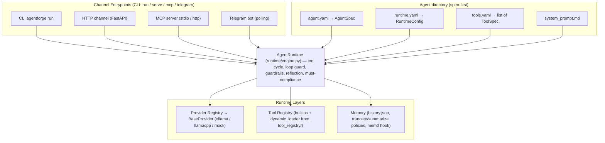

# Architecture Overview

AgentForge is a spec-first, local-first Python framework for defining and running LLM agents on-premise. Its central design thesis, stated in the README, is that **"20% is the model, 80% is the runtime"**: agent quality depends less on which model is chosen and more on how the runtime manages context, tool-use decisions, guardrails, and evaluation. The architecture is organized so that every behavioral decision is either declared in an agent's YAML spec or executed by explicit, testable mechanisms in the runtime.

## Design Principles

- **Spec-first**: an agent is born from `agent.yaml` (plus generated `runtime.yaml`, `tools.yaml`, `system_prompt.md`, `eval.yaml`). Pydantic models use `extra="forbid"`, so unknown fields are hard validation errors and the spec stays the single source of truth. No behavior exists outside the spec.
- **Local-first**: optimized for Ollama; no external API dependency in the critical path. The provider abstraction makes backends swappable (`ollama`, `llamacpp`, `mock`), and cloud providers are secondary.
- **Model-agnostic providers**: the engine never talks to a model directly; it goes through `BaseProvider.generate(ProviderRequest) → ProviderResponse`, so backends can be swapped or mocked in tests without touching the pipeline.
- **Deterministic + LLM hybrid guardrails**: `must`/`must_not` rules are enforced with deterministic checks where possible (substring search, file existence, tool-call evidence) and an LLM judge for open-ended rules.
- **4-channel flexibility**: the same agent directory runs unchanged under CLI, HTTP (FastAPI), MCP, and Telegram — each channel is a thin adapter that builds an `AgentRuntime` and calls `run()`.
- **Voyager pattern**: agents can write, test, and register their own Python tools into `tool_registry/`, which persist across sessions and become available to all agents.

## Component Diagram



*Caption: Channels wrap a single `AgentRuntime`, which is configured from the agent directory and mediates all provider, tool, and memory access.*

## High-Level Flow

```
┌─────────────────────────────────────────────────────────┐
│                   User / Channel                         │
│  CLI ── HTTP ── MCP ── Telegram                        │
└─────────────────────┬───────────────────────────────────┘
                      │
                      ▼
┌─────────────────────────────────────────────────────────┐
│              CLI / Channel Entrypoints                   │
│  agentforge run│serve│mcp│telegram                       │
└─────────────────────┬───────────────────────────────────┘
                      │
                      ▼
┌─────────────────────────────────────────────────────────┐
│              AgentRuntime (engine.py)                    │
│                                                          │
│  1. Load agent.yaml + runtime.yaml                      │
│  2. Build tools schema                                   │
│  3. Apply memory policy                                  │
│  4. Run tool calling cycle (with loop guard)            │
│  5. Check guardrails (must_not + must)                  │
│  6. Apply reflection (if configured)                    │
│  7. Save history + return result                        │
└─────────────────────┬───────────────────────────────────┘
                      │
         ┌────────────┼────────────┐
         ▼            ▼            ▼
   ┌──────────┐ ┌──────────┐ ┌──────────┐
   │ Provider │ │  Tools   │ │  Memory  │
   │  Ollama  │ │Registry  │ │History   │
   │ LlamaCpp │ │Dynamic   │ │Mem0Hook  │
   │  Mock    │ │Loader    │ │          │
   └──────────┘ └──────────┘ └──────────┘
```

## Core Components

### 1. AgentSpec System

**Location**: `src/agentforge/core/agent_models.py`, `src/agentforge/core/validation.py`

`AgentSpec` is a Pydantic model that defines everything about an agent: identity, persona, channel, `ToolSpec[]`, `MemorySpec`, `OutputSpec`, `GuardrailSpec` (`must` / `must_not` / `optional`), `EvaluationSpec`, `DeploymentSpec`, `ModelPolicySpec`, and `WorkflowSpec`. All models set `extra="forbid"`, so unknown fields in YAML produce explicit validation errors.

`validation.py` exposes the small load/validate/save helpers used everywhere: `load_yaml_file`, `validate_agent_spec`, `validate_framework_spec`, `validate_orchestrator_spec`, and `validate_all_specs` (which walks the project `specs/` directory for `framework.spec.yaml` and `orchestrator.spec.yaml`).

The spec drives system-prompt generation, runtime configuration, tool schema construction, guardrail enforcement, memory policy, and evaluation criteria. `WorkflowSpec.agents` declares the worker agents an orchestrator may delegate to via the auto-injected `run_agent` tool.

### 2. Runtime Engine

**Location**: `src/agentforge/runtime/engine.py`

`AgentRuntime` is the single execution pipeline. `AgentRuntime.from_agent_dir(path)` loads `agent.yaml` → `AgentSpec`, `runtime.yaml` → `RuntimeConfig`, and (if present) `tools.yaml` → `list[ToolSpec]`. `RuntimeConfig` is a flat, engine-oriented projection of the spec with `extra="forbid"`, so hot paths avoid nested access; a `@model_validator(mode="before")` flattens nested `model`/`workflow`/`memory`/`output` sections, and it honors the `AGENTFORGE_PROVIDER` and `AGENTFORGE_MODEL` environment overrides.

`run(input_text, *, metadata=None) → dict` is the entry point every channel calls. Its pipeline:

1. Optionally run a **required tool** (`ToolSpec.required == True`) and inject its result into the input.
2. Detect log/file intents and pre-fetch via `read_log_tail` / `extract_file_content` when those tools are declared.
3. Load `system_prompt.md` (if present) and, for multi-turn conversations, the persisted history.
4. Route by `workflow_mode`:
   - `respond_or_tool` → `_run_tool_calling_cycle` (see below).
   - Anything else → a single `provider.generate()` call with no tool schema.
5. If `workflow.reflection_rounds > 0`, run `_reflect` self-critique rounds.
6. Strip leaked `<tool_use>` XML tags from the output (qwen3.5:27b quirk).
7. If `guardrails.must_not` is non-empty, run `_apply_guardrails` (LLM judge + up to 2 correction re-inferences; if a `write_file` tool call produced a deliverable, corrections are re-checked against and re-written to that file on disk).
8. If `guardrails.must` is non-empty, run the **must-compliance loop** (up to 3 retries): `_check_must_compliance` mixes deterministic checks (quoted phrase in output, quoted filename exists in `AGENT_WORKDIR`, rule names a tool that was actually called) with an LLM judge for open rules, and on failure chains a *new* tool-calling cycle from the accumulated `cycle_messages` so previously-read file contents remain in context.
9. Update in-memory history (multi-turn only) via `apply_window`, and persist with `save_history` when memory is enabled.
10. Append a summary line to `agents/<id>/runs/runs.jsonl` and, if `memory.feed_mem0` is set, feed the turn to the mem0 hook asynchronously.

The returned dict carries `agent_id`, `provider`, `input`, `output`, a rich `metadata` block (latency, workflow mode, tool call log, guardrail violations, conversation turn), and a `provider_response` block with the raw provider response.

Key in-cylinder mechanics of `_run_tool_calling_cycle`:

- **Cycle loop**: up to `max_tool_cycles` rounds (default 3). Each round sends the accumulated `messages` (which include the assistant's `tool_calls` and the resulting `tool` messages) plus the tool schema.
- **Loop guard**: a sliding window of the last 5 `(tool, args, result)` triplets. Only an *unchanging result* trips the guard, so legitimate polling (e.g. `heygen_get_agent_session` where the result evolves) survives.
- **No-tool pushback**: if the model returns no `tool_calls` and no tool has ever been called, the engine injects a reflection prompt up to 2 times. A second gate checks `guardrails.must` for missing filename-shaped terms via `_missing_must_files` and pushes the model to call `write_file` before the cycle ends.
- **Provider-reported loop detection**: `response.metadata["loop_detected"]` (set by e.g. the llamacpp provider) triggers a separate one-shot redirect, covering the case where the model keeps reasoning but has already called tools.
- **Final inference**: when cycles are exhausted or the guard trips, the engine issues one more inference with a completion hint (including the list of tools already executed and the first three quoted `must` phrases). Tools are still offered in this call so the model can persist anything it only described; if it returns `tool_calls`, they are executed and a closing text pass runs.

### 3. Provider Abstraction

**Location**: `src/agentforge/providers/base.py`, `src/agentforge/providers/registry.py`

`BaseProvider` is a small ABC: a `name` attribute and `generate(ProviderRequest) → ProviderResponse`. `ProviderRequest` / `ProviderResponse` are Pydantic models with `extra="forbid"`, carrying `agent_id`, `input_text`, `system_prompt`, `model`, `history`, `metadata`, and `tools_schema` (OpenAI function format). `ProviderResponse` returns `output_text`, `raw_response`, `metadata` (e.g. `loop_detected`), and normalized `tool_calls` as `[{"name": ..., "arguments": {...}}]`.

`ProviderRegistry` is a simple name → class dict with case-insensitive lookup and a `ProviderNotImplementedError` for unknown names. `get_default_registry()` pre-registers `mock`, `ollama`, and `llamacpp`; additional providers can be added with `registry.register(name, ProviderClass)`. The engine obtains a provider per call via `self._get_provider()` so provider failures surface as `ProviderError` at the channel boundary.

### 4. Tool Registry

**Location**: `src/agentforge/tools/registry.py`, `src/agentforge/tools/dynamic_loader.py`

A module-level dict `_ToolRegistry: dict[str, Callable]` stores every callable tool. `register_tool(name, func, **default_kwargs)` wraps functions with default kwargs in a `functools.partial`, so a tool can carry a sensible default (e.g. `read_log_tail` defaults to `/var/log/syslog`). `execute_tool(name, **kwargs)` returns `None` for unknown tools and catches `TypeError` from bad arguments, returning `{"error": str(e)}` so a bad model call cannot crash the cycle.

`_register_builtin_tools()` (called at import time) registers the core builtins (`collect_system_health`, `read_log_tail`, `scan_directory`, `extract_file_content`, `run_agent`, `http_get`, `write_file`, `read_file`, `append_file`, `run_bash`, `send_claudio`, `fetch_social_url`, `register_tool_file`, `tts_omnivoice`, and the Heygen suite) and then calls `load_dynamic_tools()`.

`dynamic_loader.load_dynamic_tools()` reads `tool_registry/registry.yaml`, imports each listed module via `importlib.util.spec_from_file_location` under a `_agentforge_dynamic_<name>` key, and registers its exported function. Failures are swallowed so one broken tool can't break startup. This is the mechanism behind the Voyager pattern: agents write and register their own tools, and those tools persist on disk and are reloaded for every future agent.

The engine exposes tools to the model through `_build_tools_schema()`, which converts each `ToolSpec` into an OpenAI-style `{"type": "function", "function": {...}}` entry. When `workflow.agents` is non-empty it also injects a `run_agent` tool whose description lists the available worker `agent_dir`s — that is how multi-agent delegation is wired without any hard-coding in the engine.

### 5. Memory System

**Location**: `src/agentforge/runtime/memory.py`

Memory is file-backed (`history.json` in the agent directory) and policy-driven:

- **truncate** (`apply_limit`): keeps the last `max_turns * 2` messages, dropping the rest.
- **summarize** (`apply_limit_summarize`): keeps the same window verbatim and compresses overflow turns into a single `system`-role message prefixed with `Resumo da conversa anterior:`. A pluggable `SummarizerFn` (used by `mem0_hook.py`) may replace the default line-based summarizer.
- `apply_window` dispatches between the two policies based on `RuntimeConfig.memory_policy`.
- `load_history` / `save_history` / `clear_history` persist state on disk.

`AgentRuntime.__init__` only loads persisted history when `conversation.multi_turn` is set; single-turn runs always start from an empty in-memory history even if the file exists.

## Data Flow

### Agent Creation Flow

```
agentforge wizard   → agents/<id>/agent.yaml
agentforge generate → agents/<id>/{system_prompt.md, runtime.yaml, tools.yaml, eval.yaml, README.md}
agentforge run     → AgentRuntime.from_agent_dir().run() → provider.generate() → tool execution
```

### Multi-Agent Flow

`WorkflowSpec.agents: list[AgentRef]` declares workers. When non-empty, the engine injects a `run_agent` tool schema whose description lists the workers. When the orchestrator model calls it, `tools/run_agent.run_agent(agent_dir, input)` lazy-imports `AgentRuntime`, builds the worker's runtime, runs it, and returns its output as a tool result — which the orchestrator's own tool cycle then folds into its next inference.

### Tool Self-Registration Flow (Voyager)

```
Agent writes implementation.py via write_file tool
Agent writes test_implementation.py via write_file
Agent runs pytest via run_bash
Agent calls register_tool_file
  → validates file, copies into tool_registry/
  → updates tool_registry/registry.yaml
  → next load_dynamic_tools() run (any new process, or the current one after a re-register) makes it available
```

## Key Invariants

- **Spec is the contract.** Unknown fields in `agent.yaml`, `runtime.yaml`, or provider request/response are hard Pydantic errors.
- **Tools never crash the cycle.** `execute_tool` returns `None` for missing tools and `{"error": ...}` for `TypeError`; other exceptions propagate and are caught at the channel boundary (HTTP 500, Telegram error reply).
- **Guardrail retries are bounded.** `must_not` corrections retry at most 2 times; must-compliance retries at most 3. Persistent violations are logged at ERROR but the run still completes with the last text.
- **History persistence is opt-in.** Only `conversation.multi_turn` + `memory.enabled` writes to `history.json`; single-turn runs never touch the file.
- **Judge model separation.** LLM-judge calls (`_check_must_compliance`, `_check_guardrail_violations`) use `AGENTFORGE_JUDGE_MODEL` when set, falling back to `model_default` — deliberately, so an unstable candidate model can't poison its own verification.

## Source Map

| Component | Primary File |
|-----------|-------------|
| Spec models | `src/agentforge/core/agent_models.py` |
| Validation helpers | `src/agentforge/core/validation.py` |
| Runtime engine | `src/agentforge/runtime/engine.py` |
| Memory management | `src/agentforge/runtime/memory.py` |
| Provider interface | `src/agentforge/providers/base.py` |
| Provider registry | `src/agentforge/providers/registry.py` |
| Ollama provider | `src/agentforge/providers/ollama.py` |
| LlamaCpp provider | `src/agentforge/providers/llamacpp.py` |
| Mock provider | `src/agentforge/providers/mock.py` |
| Tool registry | `src/agentforge/tools/registry.py` |
| Dynamic tool loader | `src/agentforge/tools/dynamic_loader.py` |
| Tool registration (Voyager) | `src/agentforge/tools/register_tool_file.py` |
| Multi-agent tool | `src/agentforge/tools/run_agent.py` |
| Artifact generation | `src/agentforge/generators/agent_files.py` |
| CLI entrypoint | `src/agentforge/cli/main.py` |
| HTTP channel | `src/agentforge/channels/http.py` |
| MCP channel | `src/agentforge/channels/mcp_server.py` |
| Telegram channel | `src/agentforge/channels/telegram.py` |
| Evaluation judge | `src/agentforge/eval/judge.py` |
| Benchmark runner | `scripts/run_benchmark_eval.py` |
| Runtime tests | `tests/test_runtime_engine.py` (plus `test_providers.py`, `test_history_limit.py`, `test_summarize_policy.py`, `test_http_channel.py`, `test_mcp_server.py`, `test_telegram_channel.py`) |
