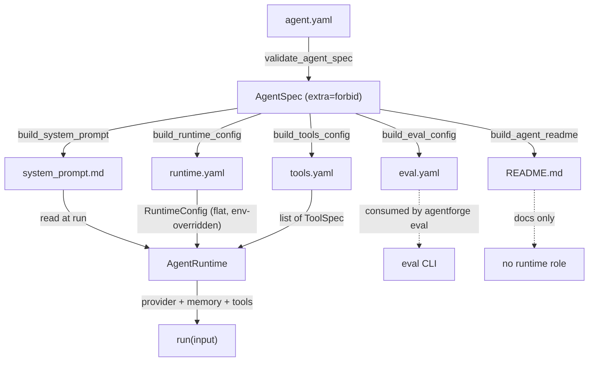

# Agent Spec System

## Overview

Every agent in AgentForge is defined by a single source of truth: **`agent.yaml`** in its agent directory. The spec is loaded into a strict Pydantic model (`AgentSpec`, all sub-models with `extra="forbid"`), then drives both artifact generation (derived files) and runtime behavior (the runtime reloads the same directory and enforces the policy). There is no behavior that exists outside the spec: tools, guardrails, memory, workflow limits, model choice, and even the delegation tool schema are all declared there.

An agent directory therefore always pairs an **authoritative** file (`agent.yaml`, hand-authored or wizard-produced) with **derived** files that the generator can regenerate at any time:

| File | Role |
|------|------|
| `agent.yaml` | Primary spec — Pydantic `AgentSpec` model. Validated at load and at runtime startup. |
| `system_prompt.md` | Generated (or hand-authored, e.g. `agents/lab-ops`) — the system prompt fed to the provider. |
| `runtime.yaml` | Generated — flat `RuntimeConfig` projection: provider, model, workflow, channel, memory, output, conversation flags. |
| `tools.yaml` | Generated — tool list as `ToolSpec` entries, parsed back by `AgentRuntime.from_agent_dir` at startup. |
| `eval.yaml` | Generated — evaluation configuration (metrics, user feedback, notes). Case datasets are kept separately and passed to `agentforge eval --dataset`. |
| `README.md` | Generated — short technical summary and configuration table for the agent. |

The `agentforge generate --path <agent.yaml>` CLI command regenerates all derived files from `agent.yaml` in place.

## AgentSpec Data Model

All spec models live in `src/agentforge/core/agent_models.py`. Every sub-model sets `ConfigDict(extra="forbid")`, so any unknown key anywhere in `agent.yaml` (including inside lists) produces a Pydantic `ValidationError` — this is the primary guard against spec drift. `AgentSpec` additionally coerces `spec_version` to a string via a `mode="before"` field validator, so YAML's native numeric `0.1` and the string `'0.1'` are both accepted.

### AgentSpec (top-level)

| Field | Type | Default | Description |
|-------|------|---------|-------------|
| `spec_version` | `str` (coerced from int) | required | Spec format version, e.g. `0.1`. |
| `agent` | `AgentIdentity` | required | Identity block. |
| `persona` | `AgentPersona` | required | Persona block. |
| `channel` | `ChannelSpec` | required | Channel block. |
| `tools` | `list[ToolSpec]` | `[]` | Declared tools; empty means the agent is pure responder. |
| `memory` | `MemorySpec` | required | Memory policy. |
| `output` | `OutputSpec` | required | Output mode/format. |
| `guardrails` | `GuardrailSpec` | required | Mandatory / forbidden / soft behavior rules. |
| `eval` | `EvaluationSpec` | required | Evaluation and judge configuration. |
| `deployment` | `DeploymentSpec` | `DeploymentSpec()` (default provider `ollama`) | Provider deployment. |
| `model_policy` | `ModelPolicySpec` | required | Default and fallback models. |
| `workflow` | `WorkflowSpec` | required | Execution workflow. |

### AgentIdentity

| Field | Type | Default | Description |
|-------|------|---------|-------------|
| `id` | `str` | required | Unique slug (e.g. `lab-ops`, `claudio_assistente`); also used as the directory name by the wizard. |
| `name` | `str` | required | Human display name. |
| `purpose` | `str` | required | Free-text description of the agent's job; surfaced in the system prompt under `## Objective`. |

### AgentPersona

| Field | Type | Default | Description |
|-------|------|---------|-------------|
| `tone` | `str` | required | e.g. `technical`, `direct`. |
| `style` | `str` | required | e.g. `precise`, `técnico`. |
| `personality` | `str \| None` | `None` | Optional personality trait; omitted from the system prompt when unset. |

### ChannelSpec

| Field | Type | Default | Description |
|-------|------|---------|-------------|
| `type` | `str` | required | `cli`, `telegram`, `web`, `api`, … |
| `interface` | `str \| None` | `None` | Optional channel interface name; the wizard sets this to the channel type. |

### ToolSpec

| Field | Type | Default | Description |
|-------|------|---------|-------------|
| `name` | `str` | required | Tool name — must resolve to a tool the runtime can execute. |
| `required` | `bool` | `False` | Marked `(mandatory)` in the system prompt. |
| `description` | `str \| None` | `None` | Base description; `when_to_use` / `when_not_to_use` are appended when the runtime builds the provider-facing schema. |
| `category` | `str \| None` | `None` | Free tag (search / compute / io / api …). |
| `status` | `str` | `stable` | `stable` \| `optional` \| `experimental`; non-stable values are annotated in the prompt. |
| `when_to_use` | `str \| None` | `None` | Positive decision hint; injected into the provider tool description as `Use when: …`. |
| `when_not_to_use` | `str \| None` | `None` | Negative hint; injected as `Do not use when: …`. |
| `input_schema` | `str \| None` | `None` | **JSON object** string parsed by `AgentRuntime._build_tools_schema` as the OpenAI-style `parameters` schema. If parsing fails, an empty object schema is used. |
| `output_schema` | `str \| None` | `None` | JSON string documenting the expected tool output. |

### MemorySpec

| Field | Type | Default | Description |
|-------|------|---------|-------------|
| `type` | `str` | required | `none` or `session_summary`; drives `load_history` selection. |
| `enabled` | `bool` | `False` | Whether memory is active. |
| `max_turns` | `int` | `0` | Turns to keep; `0` = unlimited. Applied as `max_turns * 2` messages. |
| `policy` | `str` | `truncate` | `truncate` (drop oldest) or `summarize` (compress into a summary system message). |

### OutputSpec

| Field | Type | Default | Description |
|-------|------|---------|-------------|
| `mode` | `str` | required | e.g. `text`. |
| `format` | `str \| None` | `None` | e.g. `text`, `json`; surfaced in the system prompt when set. |

### GuardrailSpec

| Field | Type | Default | Description |
|-------|------|---------|-------------|
| `must` | `list[str]` | `[]` | Rules that MUST hold; rendered under `## Mandatory Behaviors` and enforced by the runtime's compliance loop. |
| `must_not` | `list[str]` | `[]` | Rules that MUST NOT be violated; rendered under `## Forbidden Behaviors`. |
| `optional` | `list[str]` | `[]` | Soft guidelines (not currently surfaced by the generator). |

### EvaluationSpec

| Field | Type | Default | Description |
|-------|------|---------|-------------|
| `user_score_enabled` | `bool` | `False` | Whether to record a user score during evaluation runs. |
| `notes` | `str \| None` | `None` | Free notes carried into `eval.yaml`. |
| `criteria` | `list[str]` | `[]` | Judge criteria; required together with `judge_model` to enable LLM judging. |
| `judge_model` | `str \| None` | `None` | Model used for scoring (e.g. `gemma4:e4b`). |

### DeploymentSpec

| Field | Type | Default | Description |
|-------|------|---------|-------------|
| `provider` | `str` | `ollama` | LLM provider (`ollama`, `llamacpp`, …); overridden at runtime by `AGENTFORGE_PROVIDER`. |

### ModelPolicySpec

| Field | Type | Default | Description |
|-------|------|---------|-------------|
| `default_model` | `str` | required | Primary model; overridden at runtime by `AGENTFORGE_MODEL`. |
| `fallback_model` | `str \| None` | `None` | Fallback model. |

### WorkflowSpec

| Field | Type | Default | Description |
|-------|------|---------|-------------|
| `mode` | `str` | required | e.g. `respond_or_tool`; forwarded to `RuntimeConfig.workflow_mode`. |
| `multi_turn` | `bool` | `False` | Whether to persist history; mapped to `RuntimeConfig.conversation_multi_turn`. |
| `max_tool_cycles` | `int` | `3` | Upper bound on tool-calling rounds per run. |
| `reflection_rounds` | `int` | `0` | Self-critique rounds after the final response. |
| `agents` | `list[AgentRef]` | `[]` | Worker agents for delegation; when non-empty, the runtime injects a `run_agent` tool whose description lists each worker's `agent_dir`. |

### AgentRef

| Field | Type | Default | Description |
|-------|------|---------|-------------|
| `name` | `str` | required | Worker display name. |
| `agent_dir` | `str` | required | Path to the worker's agent directory (relative to the framework root). |
| `description` | `str \| None` | `None` | Shown in the injected `run_agent` tool description. |

## Validation

Validation lives in `src/agentforge/core/validation.py` and is purely Pydantic-driven — the strictness comes from `extra="forbid"` on every model, not from custom checks:

- **`load_yaml_file(path)`** — reads a YAML file, raises `FileNotFoundError` when missing and `ValueError` when the top level is not a mapping.
- **`validate_agent_spec(path)`** — returns a validated `AgentSpec`. Used by `agentforge validate-agent --path`, by `generate_agent_files`, and by `AgentRuntime.from_agent_dir` at every run.
- **`save_agent_spec(path, spec)`** — `model_dump()` + `yaml.safe_dump` with `allow_unicode=True, sort_keys=False`; creates parent directories. This is what the wizard writes.
- **`validate_framework_spec` / `validate_orchestrator_spec` / `validate_all_specs(root)`** — framework-level specs (`specs/framework.spec.yaml`, `specs/orchestrator.spec.yaml`) validated against `FrameworkSpec` and `OrchestratorSpec` from `src/agentforge/core/models.py`; `validate_all_specs` returns a `ValidationResult` per file instead of raising, and the `agentforge validate` CLI renders them as a table (exits non-zero if any fail).

The `AgentSpec` roundtrip is deterministic: `save_agent_spec` → `validate_agent_spec` returns a model-equal spec, so `agent.yaml` is safe to treat as a generated artifact of `AgentSpec` itself.

## Wizard

`agentforge wizard --root .` invokes `run_agent_wizard(root)` in `src/agentforge/wizard/flow.py`. The wizard walks the prompt sequence in a fixed order — identity (name, id, purpose), channel & persona (type, tone, style, personality), model & provider (default, fallback, provider), workflow (mode, multi-turn confirm), memory (enable confirm, then type/turn-limit/policy only if enabled), output & evaluation (format, user-score confirm), guardrails (comma-separated `must` / `must_not`), and finally a loop of per-tool prompts (`_wizard_single_tool`) for each declared tool.

Notes on the wizard's construction of the spec:

- The agent ID defaults to `_slugify(name)` and is reused as the target directory: `root/agents/<agent_id>/agent.yaml`.
- `ChannelSpec.interface` is set to the channel type, and `OutputSpec.format` is set to the output format (both mirror the primary value, since the wizard only asks for one).
- Guardrails: only `must` and `must_not` are prompted; `optional` is left empty.
- After writing `agent.yaml`, the wizard immediately calls `generate_agent_files` so the derived files exist without a second CLI invocation, and prints the exact `agentforge run --agent-dir … --input "Hello"` command for a first smoke test.

## Artifact Generation

`generate_agent_files(agent_spec_path)` in `src/agentforge/generators/agent_files.py` validates the spec, then writes the derived files next to `agent.yaml`. The module-level constant `_GENERATED_FILES = ["agent.yaml", "system_prompt.md", "runtime.yaml", "eval.yaml", "tools.yaml", "README.md"]` is used by `build_agent_readme` to list what the generator owns.

| Builder | Output | Contents |
|---------|--------|----------|
| `build_system_prompt(spec)` | `system_prompt.md` (Markdown) | Sections: Identity, Objective, Persona, Channel, Mandatory Behaviors, Forbidden Behaviors, Available Tools, Memory Policy, Output Format, Model and Workflow Policy. Tools are listed with `**(mandatory)**`, category, and non-stable status tags; `when_to_use` / `when_not_to_use` / `input_schema` / `output_schema` are inlined. |
| `build_runtime_config(spec)` | `runtime.yaml` (YAML) | Nested dict with `runtime_version`, `agent_id`, `provider`, `model.{default,fallback}`, `workflow.{mode,max_tool_cycles,reflection_rounds}`, `channel.type`, `memory.{enabled,type,max_turns,policy}`, `output.{mode,format}`, `conversation.multi_turn`. `AgentRuntime` flattens this via a `mode="before"` validator. |
| `build_eval_config(spec)` | `eval.yaml` (YAML) | `eval_version`, `agent_id`, the fixed metric list (`semantic_quality`, `tool_use_compliance`, `format_validity`, `consistency`), `user_feedback.{enabled,scale}`, `notes`. |
| `build_tools_config(spec)` | `tools.yaml` (YAML) | `tools_version`, `agent_id`, and the full `ToolSpec` list — this is what `AgentRuntime.from_agent_dir` reparses into `list[ToolSpec]` at startup. |
| `build_agent_readme(spec)` | `README.md` (Markdown) | Title, spec version, purpose, configuration table (channel, model, workflow, memory, tools, output), and the `_GENERATED_FILES` list. |

`agentforge generate --path agents/lab-ops/agent.yaml` is the entrypoint; the wizard calls the same function after writing the spec.

## Spec → Artifacts → Runtime

*Caption: `agent.yaml` is validated once per run into `AgentSpec`; the generator and the runtime each re-derive a different projection of the same spec, so the runtime never reads `agent.yaml`'s persona/guardrail sections directly — it reads the generated files.*

At runtime, `AgentRuntime.from_agent_dir(path)` performs a second validation pass: it reloads `agent.yaml` into `AgentSpec`, reads `runtime.yaml` into `RuntimeConfig` (whose `mode="before"` validator flattens nested sections and applies the `AGENTFORGE_PROVIDER` / `AGENTFORGE_MODEL` env overrides), and reparses `tools.yaml` into `list[ToolSpec]`. `system_prompt.md` is read on demand by `_read_system_prompt`. `eval.yaml` and `README.md` have no runtime role — `eval.yaml` is documentation for the `agentforge eval` command and the case datasets live in a separate `--dataset` file.

## Runtime Config and Environment Overrides

`RuntimeConfig` (in `src/agentforge/runtime/engine.py`) is the flat, engine-facing projection of `runtime.yaml`:

- Fields include `runtime_version`, `agent_id`, `provider`, `model_default`, `model_fallback`, `workflow_mode`, `channel_type`, `memory_*`, `output_*`, `conversation_multi_turn`, `max_tool_cycles`, `reflection_rounds`.
- A `@model_validator(mode="before")` accepts both the nested generator layout and the flat field layout, and reads `os.environ["AGENTFORGE_PROVIDER"]` / `AGENTFORGE_MODEL` — non-empty env values override the corresponding `runtime.yaml` values at load time. This is the only supported override mechanism; there is no CLI flag.
- `memory_feed_mem0` is a separate flag on `RuntimeConfig` that is *not* produced by `build_runtime_config`; agents that use Mem0 memory set it manually in `runtime.yaml` (see `agents/lab-ops/runtime.yaml`).

## Multi-Agent Delegation

`WorkflowSpec.agents` is the only multi-agent surface in the spec. When non-empty, `AgentRuntime._build_tools_schema` appends a synthetic `run_agent` tool to the provider-facing schema with:

- `description` listing every `AgentRef` as `- <name> (agent_dir=<dir>): <description>`.
- Parameters `agent_dir` (required, must be one of the declared values) and `input` (required).

The spec deliberately keeps delegation declarative: the worker's own `agent.yaml` is the source of truth for what the worker can do, and the parent only lists which worker directories it can route to.

## Invariants and Failure Modes

- **Unknown key ⇒ error, not warning.** Any extra key anywhere in `agent.yaml` (including inside `tools:` entries) fails validation with a Pydantic `ValidationError` naming the offending field. This is the primary drift-prevention mechanism.
- **Roundtrip stability.** `save_agent_spec` → `validate_agent_spec` is identity for every supported spec (covered by `tests/test_wizard_and_agent_spec.py::test_save_and_reload_roundtrip`).
- **`input_schema` is a JSON string, not an object.** It is `json.loads`-ed by `_build_tools_schema`; a malformed value degrades to an empty object schema rather than failing the run.
- **Generated files are disposable.** `system_prompt.md`, `runtime.yaml`, `tools.yaml`, `eval.yaml`, and `README.md` can all be regenerated from `agent.yaml` with `agentforge generate`. Hand-edited generated files (e.g. `agents/lab-ops/system_prompt.md`, which is a bespoke prompt rather than the generated one) will be overwritten on regeneration.
- **`validate_all_specs` is framework-only.** It validates `specs/framework.spec.yaml` and `specs/orchestrator.spec.yaml`; per-agent specs are validated separately via `validate_agent_spec` (CLI: `agentforge validate-agent --path`).

## Tests

- `tests/test_wizard_and_agent_spec.py` — roundtrip of `save_agent_spec` / `validate_agent_spec`, wizard flow with monkeypatched `typer.prompt` / `typer.confirm` (both minimal and full specs, including tool declaration), and ID slug behavior.
- `tests/test_validate_specs.py` — framework/orchestrator spec loading from `specs/` and the `validate_all_specs` success and failure paths.
- `tests/test_generate_agent_files.py` — each `build_*` function against a minimal and a full spec; asserts every expected section is present in the system prompt and that the runtime/tools/eval/README payloads carry the right fields.
- `tests/test_runtime_engine.py` — integration tests exercising `AgentRuntime.from_agent_dir` end-to-end, including the `AGENTFORGE_PROVIDER` / `AGENTFORGE_MODEL` env overrides and the injected `run_agent` schema.

## Source References

| File | Role |
|------|------|
| `src/agentforge/core/agent_models.py` | All Pydantic spec models (`AgentSpec` and friends), all with `extra="forbid"`. |
| `src/agentforge/core/models.py` | Framework-level spec models (`FrameworkSpec`, `OrchestratorSpec`) and `ValidationResult`. |
| `src/agentforge/core/validation.py` | `load_yaml_file`, `validate_agent_spec`, `save_agent_spec`, `validate_framework_spec`, `validate_orchestrator_spec`, `validate_all_specs`. |
| `src/agentforge/wizard/flow.py` | `run_agent_wizard` — interactive spec authoring. |
| `src/agentforge/generators/agent_files.py` | `build_system_prompt`, `build_runtime_config`, `build_eval_config`, `build_tools_config`, `build_agent_readme`, `generate_agent_files`. |
| `src/agentforge/runtime/engine.py` | `RuntimeConfig` (flat projection with env overrides), `AgentRuntime.from_agent_dir` (second validation pass), `_build_tools_schema` (delegation tool injection). |
| `src/agentforge/cli/main.py` | CLI entrypoints: `wizard`, `validate`, `validate-agent`, `generate`, `run`, `eval`. |
| `agents/lab-ops/` | Reference agent showing a hand-authored `system_prompt.md` alongside the generated `runtime.yaml`, `tools.yaml`, `eval.yaml`. |
