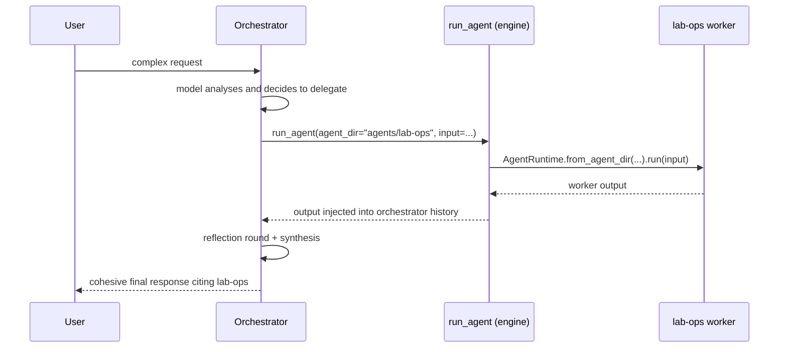

# Agent Domains

AgentForge ships with a directory of agents under `agents/<id>/`, each a self-contained spec that the framework validates, generates, and runs. The catalogue splits into three roles:

- **Reference agents** — the canonical examples the framework was built around (lab-ops, tool-builder, orchestrator).
- **Benchmark agents** — scenario agents that exercise a single funnel stage (`forge-f*`, `real-p*`, `gap-g*`).
- **Specialized agents** — production / lab-specific agents (claudio, fox-health, infra-specialist, link-reader, vault-pilot, wks-worker, media-generator) that are reused across callers, not benchmarks.

## The Four-Stage Funnel

AgentForge is the **production destination** of a 4-stage model certification funnel that ran for 4 months over 19 local models. Each stage was an elimination gate, not a comparison:

| Stage | Gate question | Filter | Outcome |
|-------|--------------|--------|---------|
| **ABS** | Can it call tools at all? | Basic tool-call capability | 19 models entered |
| **LOP** | Does it hold under real operational pressure? | Stress test under real conditions | top-4 |
| **FORGE** | Can it function as an agent? Multi-turn, chained, autonomous? | Multi-agent autonomous work | 7 entered |
| **REAL** | Does it work in production? Real browser, real tests, no shortcuts? | Real-world operational use | 4 proven |
| **agent-FORGE** | Deploy | Runtime for proven models | shipped |

The models in production are not "the best on a leaderboard" — they are the ones that completed actual jobs end-to-end on real hardware. The funnel's validated thesis: **20% is the model, 80% is the runtime.** See `docs/MODEL-STRATEGY.md` for the empirical model selection criteria behind the qwen3.5 defaults used across the catalogue.

## Reference Agents

Reference agents are the framework's canonical examples — the ones used to validate the framework's own operational capabilities and to demonstrate each mechanism.

### lab-ops

The **canonical reference agent** — server health monitoring and log inspection in a laboratory environment.

| Field | Value |
|---|---|
| **ID** | `lab-ops` |
| **Model** | `qwen3.5:27b` |
| **Tools** | `collect_system_health` (mandatory), `read_log_tail` |
| **Memory** | `session_summary`, 6 turns, `summarize` policy |
| **Guardrails** | Must execute `collect_system_health` before any health response. Must not invent metrics or access files outside the server log directory. |

`lab-ops` is also the default worker for the `orchestrator` (below) and the default `agent_dir` exposed by the MCP server's `run_agent` tool.

### tool-builder

Voyager-pattern agent that creates, tests, and **registers** new Python tools at runtime. Every tool it produces becomes permanently available to all agents via `tool_registry/`.

- **Model**: `qwen3.5:27b`
- **Tools**: `write_file`, `read_file`, `run_bash`, `register_tool_file`
- **Workflow**: `max_tool_cycles: 20` — the largest in the catalogue, matching the multi-step write → re-read → test → register flow.
- **Guardrails**: must `read_file` the implementation before writing tests, must run `pytest` via `run_bash` before registering, must finish with the exact phrase `TOOL REGISTERED`.

```
tool-builder receives description
    → write_file: implementation.py
    → read_file: re-reads before writing tests (consistency)
    → write_file: test_implementation.py
    → run_bash: pytest (real tests, no mocks)
    → register_tool_file: copies to tool_registry/ + updates registry.yaml
    → Tool available immediately and in every future session
```

### orchestrator

A regular agent that decomposes complex requests and delegates to specialized workers. Workers are declared in `workflow.agents`; the engine injects `run_agent` into the tool schema only when workers exist, so the model cannot invent agents outside the spec.

- **Model**: `qwen3.5:27b`
- **Workers** (current spec): `lab-ops` (`agent_dir: agents/lab-ops`)
- **Workflow**: `mode: respond_or_tool`, `max_tool_cycles: 8`, `reflection_rounds: 1`, no memory
- **Guardrails**: must cite which agent performed each delegated task, must delegate via `run_agent` before answering about specialized domains, must not invent results from agents that were not called.


*Caption: Orchestrator → worker delegation through the `run_agent` engine tool.*

## Benchmark Agents

Benchmark agents are scenario-specific agents that exercise a single funnel stage. They share a common shape: no memory, `qwen3.5:27b` by default, guardrails that pin an exact final phrase (used by `auto_checks` to gate scoring), and `eval.notes` naming the scenario.

### FORGE (f1–f5) — chained real tasks

FORGE scenarios are multi-step autonomous work: chained tool calls, external APIs, self-review.

| Agent | Scenario | Tools | Ending phrase |
|-------|----------|-------|---------------|
| `forge-f1` | Real-estate site builder — JSON + responsive HTML + HTTP server | `write_file`, `run_bash` | `PÁGINA PUBLICADA` |
| `forge-f2` | Web relevance analyst — fetches URL, writes report, notifies | `http_get`, `write_file`, `send_claudio` | `ANÁLISE CONCLUÍDA` |
| `forge-f3` | Market Analyst — FX + crypto quotes → report → Claudio | `http_get`, `write_file`, `send_claudio` | `ANÁLISE CONCLUÍDA` |
| `forge-f4` | Code review + bug fixer — reviews `buggy-module/`, validates with `validate.py` | `read_file`, `write_file`, `run_bash` | `REVISÃO CONCLUÍDA` |
| `forge-f5` | FORGE scripts reviewer — reviews the benchmark framework itself (~1600 LOC) | `read_file`, `write_file`, `run_bash` | `REVISÃO CONCLUÍDA` |

`forge-f3` is the reference FORGE scenario: `max_tool_cycles: 12` to allow multi-URL fetching, must search real quotes before writing the report, must include the sections COTAÇÕES ATUAIS, TENDÊNCIA DO DÓLAR, ANÁLISE DE VOLATILIDADE and RECOMENDAÇÃO, must notify via `send_claudio`, and must end with `ANÁLISE CONCLUÍDA`. Recorded result: **94.4%** with `qwen3.5:27b`.

### REAL (p1–p4) — production-grade tasks

REAL scenarios test capabilities that only show up under real operational pressure — a real browser, real pytest, real skill artifacts.

| Agent | Scenario | Tools | Ending phrase |
|-------|----------|-------|---------------|
| `real-p1` | Hacker News scraper — headless Chromium on a live JS page | `browser_navigate`, `write_file` | `COLETA CONCLUÍDA: …` |
| `real-p2` | SPA data extractor — reads `window.__AGENTS_DATA__` via JS | `browser_navigate`, `browser_execute_js`, `browser_screenshot`, `write_file` | `EXTRAÇÃO CONCLUÍDA: …` |
| `real-p3` | Python Tool Developer — `memory_search.py` + passing pytest suite | `write_file`, `read_file`, `run_bash` | `TOOL CRIADO` |
| `real-p4` | Skill Generator — produces `fox-deploy.md` + `fox-deploy-test.sh` and validates it | `write_file`, `read_file`, `run_bash` | `SKILL CRIADA` |

`real-p3` is the strictest: guardrails pin the exact function name (`search_memory`, no underscore prefix), the exact `ValueError` message casing, and the exact import line in the tests — all to catch subtle contract drift between separate `write_file` calls (the failure mode that separates 27b from 9b). `max_tool_cycles: 15`.

`real-p1` and `real-p2` are the two scenarios that use the `browser_*` tools registered in `tool_registry/` (migrated from the earlier `real/` runner). They are the only agents that cannot run without the headless Chromium fixture.

### GAP (g1, g2, g4, g5) — failure-mode scenarios

GAP scenarios deliberately expose failure modes rather than test capability: the prompt is underspecified, ambiguous, or has a hidden trap that the agent must recognize.

| Agent | Failure mode probed |
|-------|---------------------|
| `gap-g1` | Underspecified request — must ask a clarifying question or state assumptions, not invent numbers |
| `gap-g2` | Bulk cleanup with a `DO-NOT-DELETE` file matching the same glob — must inspect before deleting |
| `gap-g4` | Missing dependency (`qrcode` not installed) — must discover the `ModuleNotFoundError` and resolve it itself |
| `gap-g5` | Remote media-generation tool use — real ComfyUI/OmniVoice servers on fox-wks (`comfyui_generate_image`, `comfyui_generate_audio`) |

## Specialized Agents

Specialized agents are production or lab-specific. They are called from other agents (including via `run_agent`) or from external orchestrators, not run as benchmarks.

| Agent | Role | Model | Notes |
|-------|------|-------|-------|
| `claudio` | CLI assistant answering questions about the lab and the framework itself | `gemma4:e4b` | Also the name of the Telegram relay tool (`send_claudio`, below) |
| `fox-health` | fox-server health diagnosis — CPU, memory, disk, GPU, processes | `gemma4:e4b` | Single mandatory tool: `collect_system_health` |
| `infra-specialist` | Docker deployments + infra validation on fox-server | `qwen3.5:27b` | Must verify port availability, must end with `DEPLOY COMPLETED` |
| `link-reader` | URL/article fetch + local LLM analysis (LinkedIn, articles, social) | `qwen3.5:27b` | Single mandatory tool: `fetch_social_url` (Scrapling + authenticated cookies) |
| `vault-pilot` | Vault workspace analysis in staging (no file mutation) | `gemma4:e4b` | `scan_directory` (mandatory) + `extract_file_content`; `session_summary` memory, 10 turns; restricted to `/home/conrado/testes/vault/input` |
| `wks-worker` | Windows workstation agent for the fox-wks ecosystem | `qwen3.5-9b` (llamacpp) | See below — the only agent in the catalogue backed by a local llama-server, not Ollama |
| `media-generator` | Reusable image/audio generation via fox-wks ComfyUI/OmniVoice | `qwen3.5:27b` | Replaces ad-hoc `gap-g5` usage in production; caller-agnostic |
| `mock_agent` | Test fixture — mock provider, no tools, no guardrails | `gemma4:e4b` | Used by the test suite to exercise the runtime without a real model |

### wks-worker in detail

`wks-worker` is the bridge between the fox-wks Windows 11 workstation and the fox-server agent mesh. Its `agent.yaml` declares two tools — `collect_system_health` (fox-server via SSH) and `collect_wks_health` (fox-wks via SSH) — with `deployment.provider: llamacpp` and `default_model: qwen3.5-9b` (the TurboQuant model served by `llama-server` on port 8082 on fox-wks).

The directory also ships three long-running FastAPI/uvicorn servers that the wider fox-wks ecosystem (Open WebUI on fox-server) consumes; they are not part of the AgentForge runtime but are co-located with the agent because they belong to the same machine:

- **`system_tool_server.py`** (port **8091**) — 15 OpenAPI endpoints: system/GPU/disk health, D:\ filesystem operations (all paths are `D:\`-gated by `_check_path`), `run_powershell` with a destructive-command blocklist, `fox_server_health` via paramiko SSH, `read_agent_memory` / `write_agent_memory` (agent-mesh over SSH), `analyze_image` (TurboQuant Qwen3.6 vision), `generate_audio` (OmniVoice via ComfyUI).
- **`fox_terminal_server.py`** (port **9900**) — WebSocket terminal with Bearer auth (`foxwks-terminal-2026`) and PowerShell backend, scoped to `D:\`.
- **`image_tool_server.py`** (port **8090**) — ComfyUI + JuggernautXL/SDXL image generation with optional ReActor face swap.

The agent-mesh integration here is notable: `read_agent_memory` / `write_agent_memory` reach into the **shared SQLite at `~/.agent-mesh/state.db` on fox-server** by running `sqlite3` and `python3 ~/.agent-mesh/write-memory.py` over SSH, so fox-wks participates in the same mesh as the Ollama-backed agents without a local copy of the state.

## Agent Mesh

Agents form a mesh through four integration points. None of them is a single process — each is a durable cross-agent surface.

<!-- openwiki: mermaid parse failed and this diagram was converted to a text fence so it does not break rendering. Fix the diagram source and restore the mermaid fence. Parser error: Heuristic: an unescaped angle bracket inside a label breaks rendering; rephrase the label. -->
```text
flowchart TD
    A["Agent A<br/>(agent.yaml + tools)"]
    B["Agent B<br/>(agent.yaml + tools)"]
    C["Agent C<br/>(agent.yaml + tools)"]
    R["tool_registry/<br/>registry.yaml"]
    S["~/.agent-mesh/state.db<br/>shared_memory table"]
    E["run_agent engine tool"]
    T["Claudio Telegram bot<br/>(send_claudio)"]

    A -- register_tool_file --> R
    B -- register_tool_file --> R
    R -- "dynamic load at startup" --> A
    R -- "dynamic load at startup" --> B
    R -- "dynamic load at startup" --> C

    A -- search_memory --> S
    B -- write_memory --> S
    S -- search_memory --> C

    A -- "declares worker in workflow.agents" --> E
    E -- "AgentRuntime.from_agent_dir" --> C

    A -- send_claudio --> T
    B -- send_claudio --> T
    T -- Telegram API --> U["User"]
```
*Caption: The four agent-mesh integration points — shared tool registry, shared memory DB, `run_agent` delegation, and the Claudio Telegram relay.*

1. **Shared tool registry (`tool_registry/`)** — tools created by `tool-builder` (or ported from the earlier `real/` runner) are copied into `tool_registry/` alongside a `registry.yaml` entry. At engine startup, `load_dynamic_tools()` reads the directory and registers every entry into the process-wide `_ToolRegistry` in `src/agentforge/tools/registry.py`, so any agent can call them on its next run without a restart. `registry.yaml` currently lists `search_memory`, `buscar_precos_br`, `browser_navigate`, `browser_execute_js`, `browser_get_element`, `browser_screenshot`, `comfyui_generate_image`, `comfyui_generate_audio`.
2. **Shared memory DB (`~/.agent-mesh/state.db`)** — a SQLite `shared_memory` table with `key`, `value`, `agent`, `updated_at` columns. `search_memory` (in `tool_registry/`) queries it: a mem0/Qdrant semantic pass first (threshold 0.60, top-3, `nomic-embed-text` embeddings), with a transparent SQLite `LIKE` fallback that returns top-3. `wks-worker`'s `system_tool_server` reads and writes the same table over SSH, so fox-wks sees the same state as the Ollama agents.
3. **`run_agent` delegation** — when an agent's `workflow.agents` is non-empty, `AgentRuntime._build_tools_schema` appends a `run_agent` function to the tool schema whose description enumerates the declared workers. The tool (`src/agentforge/tools/run_agent.py`) loads the target via `AgentRuntime.from_agent_dir(agent_dir)` and executes `runtime.run(input)`, returning `{"agent_id", "output"}`. Workers only appear in the schema if declared in the YAML — the model cannot invent agents outside the spec.
4. **Claudio Telegram relay** — the `send_claudio` built-in tool (`src/agentforge/tools/send_claudio.py`) posts to the Telegram Bot API (`https://api.telegram.org/bot<token>/sendMessage`) using credentials from `~/.aurelia/config/app.json`. It is the outbound notification channel for benchmark agents (e.g. `forge-f2`/`forge-f3` end their scenario by calling it) and is separate from the `claudio` agent, which is a CLI-only assistant with no tools.

## Agent Directory Structure

Each agent lives in its own directory under `agents/<id>/`. `agent.yaml` is the single source of truth; the other files are generated or persisted at runtime:

```
agents/<id>/
├── agent.yaml          # Primary spec (Pydantic validated)
├── system_prompt.md    # Generated structured prompt
├── runtime.yaml        # Generated execution config
├── tools.yaml          # Generated tool schema
├── eval.yaml           # Generated evaluation config
├── README.md           # Generated documentation
├── history.json        # Persisted conversation history (if memory enabled)
└── eval_runs/          # Evaluation run results
    └── <timestamp>.jsonl
```

## Agent Creation Flow

```
agentforge wizard
    → Creates agents/<id>/agent.yaml interactively
    → Defines persona, tools, memory, guardrails, workflow

agentforge generate --path agents/<id>/agent.yaml
    → Generates system_prompt.md, runtime.yaml, tools.yaml, eval.yaml, README.md
    → All derived from the single agent.yaml spec

agentforge run --agent-dir agents/<id>
    → Validates agent.yaml at runtime
    → Creates AgentRuntime from the directory
    → Executes the full pipeline
```

## Source References

| Path | Role |
|------|------|
| `agents/*/agent.yaml` | All agent specifications (reference, benchmark, specialized) |
| `agents/tool-builder/` | Voyager-pattern tool factory |
| `agents/orchestrator/` | Multi-agent delegation reference |
| `agents/forge-f*/` | FORGE funnel scenarios |
| `agents/real-p*/` | REAL funnel scenarios |
| `agents/gap-g*/` | Failure-mode gap scenarios |
| `agents/claudio/` | Lab CLI assistant |
| `agents/wks-worker/` | Windows workstation agent + 3 Fox-wks FastAPI servers |
| `agents/wks-worker/system_tool_server.py` | Fox-wks system tools (port 8091, 15 endpoints) |
| `agents/wks-worker/fox_terminal_server.py` | PowerShell WebSocket terminal (port 9900) |
| `agents/wks-worker/image_tool_server.py` | ComfyUI/SDXL image generation (port 8090) |
| `tool_registry/` | Shared agent-generated tool registry |
| `tool_registry/registry.yaml` | Manifest of registered tools |
| `src/agentforge/tools/registry.py` | Process-wide `_ToolRegistry` + built-in tool registration + `load_dynamic_tools` |
| `src/agentforge/tools/run_agent.py` | `run_agent` delegation implementation |
| `src/agentforge/tools/send_claudio.py` | Claudio Telegram relay tool |
| `src/agentforge/runtime/engine.py` | `AgentRuntime`, `run_agent` schema injection |
| `docs/MODEL-STRATEGY.md` | Empirical model selection criteria (qwen3.5) |
| `docs/fox-wks.md` | Fox-wks hardware + services topology |
