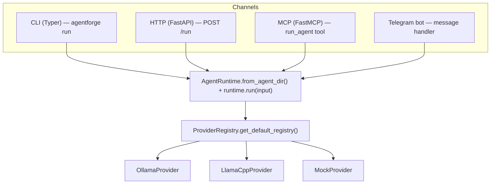

# Providers & Channels

AgentForge separates *how a model is reached* (providers) from *how a user reaches the agent* (channels). Providers live under `src/agentforge/providers/` and implement a single `generate()` method; channels live under `src/agentforge/channels/` plus the Typer CLI, and every one of them funnels into `AgentRuntime.run()`.

## Providers

All providers implement `BaseProvider.generate(ProviderRequest) -> ProviderResponse` (`src/agentforge/providers/base.py`):

- **ProviderRequest** fields: `agent_id`, `input_text`, `system_prompt`, `model`, `history`, `metadata`, `tools_schema` (OpenAI function format).
- **ProviderResponse** fields: `provider`, `model`, `output_text`, `raw_response`, `metadata`, `tool_calls`.
- `ProviderError` is the base exception; each provider subclasses it (e.g. `OllamaConnectionError`, `LlamaCppResponseError`) so channels can distinguish connection, timeout, and malformed-response failures.

### Provider Registry

**Location**: `src/agentforge/providers/registry.py`

`ProviderRegistry` maps lowercased names to `BaseProvider` classes. `get_default_registry()` registers exactly three: `mock`, `ollama`, and `llamacpp`. Unknown names raise `ProviderNotImplementedError` listing the registered names. New backends are added by subclassing `BaseProvider` and calling `registry.register(name, ProviderClass)` — no channel or runtime code changes required.

`AgentRuntime._get_provider()` instantiates the provider for every run via the default registry, using the provider name resolved at runtime-config load time (see [Configuration](#configuration)).

### Ollama Provider

**Location**: `src/agentforge/providers/ollama.py`

The primary backend for local models. Configuration (read at module import):

| Env Var | Default | Description |
|---------|---------|-------------|
| `OLLAMA_HOST` | `http://localhost:11434` | Ollama server URL |
| `OLLAMA_TIMEOUT` | `900` | Request timeout in seconds |

`generate()` branches on the request:

- **`/api/generate`** — used when the request has no history and no tools. Wraps the system prompt and input in a single `prompt` string (`<System>...</System>\n<User>...</User>`), `stream: false`, `temperature: 0`.
- **`/api/chat`** — used when history or `tools_schema` is present. Sends OpenAI-style messages plus `"think": False` in the payload to disable Qwen3 thinking mode (which otherwise yields an empty `message.content`).

Chat-path special handling:

1. **Empty user message guard** — an empty `input_text` is skipped when building the message list; an empty user message after tool results produces empty responses on qwen3.5:9b.
2. **Thinking fallback** — if `message.content` is empty and no `tool_calls` came back, a non-empty `message.thinking` is used as the output text.
3. **Regex tool-call extraction** — if the API returned no structured `tool_calls`, two regex patterns scan the output text: `name({...})` function-style calls, and JSON objects with `name`/`tool`/`tool_name` + `arguments`/`args` keys. This covers models that emit tool calls as text.
4. **Hard failure** — if after all fallbacks there is still no output text and no tool calls, `OllamaResponseError` is raised with a diagnostic hint about malformed conversation history (e.g. tool results without a preceding assistant+tool_calls message).

### LlamaCpp Provider (TurboQuant)

**Location**: `src/agentforge/providers/llamacpp.py`

Backend for llama.cpp / TurboQuant servers (OpenAI-compatible, SSE-streamed) — used where Ollama isn't available. Configuration:

| Env Var | Default | Description |
|---------|---------|-------------|
| `LLAMACPP_HOST` | `http://localhost:8082` | llama.cpp server URL |
| `LLAMACPP_TIMEOUT` | `900` | Wall-clock deadline for the whole generation (not chunk inactivity) |
| `LLAMACPP_THINKING_BUDGET` | `0` | `0` disables thinking (`chat_template_kwargs.enable_thinking=false`); N>0 enables it and raises `max_tokens` to N+8192 |
| `LLAMACPP_LOOP_GUARD_TOKENS` | `6000` | Abort the stream if this many tokens arrive with zero content and zero tool_calls |
| `LLAMACPP_REPETITION_THRESHOLD` | `6` | Abort if a line ≥20 chars repeats this many times in the content tail |

Behavior worth knowing before changing it:

- **GPU broker**: each call acquires a GPU slot via `acquire_gpu(client=..., priority="batch", max_wait_s=total_timeout)`; the wall-clock timeout clock starts *after* the broker hand-off so queue waiting doesn't burn the generation budget.
- **History normalization**: AgentForge's Ollama-style `tool_calls` are converted to OpenAI-compat format (`id`, `type: "function"`, stringified `arguments`), and matching `tool_call_id`s are back-filled onto `tool` result messages — llama.cpp rejects the unnormalized form.
- **Tag-format tool-call fallback**: models whose templates llama.cpp doesn't parse natively (served with `--skip-chat-parsing`) dump `<tool_call>name<arg_key>...</arg_key>...<arg_value>...</arg_value></tool_call>` tags into content. `_parse_tag_tool_calls()` extracts them into structured calls and strips them from the output.
- **Truncated tool call**: if a streamed tool call's JSON arguments are cut off (max_tokens hit mid-argument), the call is dropped and a `[SYSTEM NOTE: ...]` is appended to the output instructing the model to split content across `write_file`/`append_file` calls instead of silently calling the tool with `{}` arguments.
- **Loop guards**: besides the token-count "reasoning without acting" guard, a batched repetition check over the last ~8000 chars catches templates that leak thinking into `content` (e.g. gemma4) by detecting repeated long lines.
- **UTF-8 decoding**: SSE lines are decoded explicitly as UTF-8 rather than trusting requests' charset guessing, because llama.cpp doesn't declare a charset and accented content otherwise comes back mojibaked.

### Mock Provider

**Location**: `src/agentforge/providers/mock.py`

Deterministic provider for tests: returns `MOCK_PROVIDER_RESPONSE [turn N]: <input>` computed from `len(history)//2`, no external calls. This is what lets the test suite run without Ollama or a GPU.

## Channels

Channels are the user-facing entrypoints. They all construct an `AgentRuntime` (typically via `AgentRuntime.from_agent_dir()`) and call `runtime.run(input)`, so the same agent spec runs on all four channels without modification.



*Channel → AgentRuntime → provider dispatch: every channel resolves its provider through the same registry.*

### CLI Channel

**Location**: `src/agentforge/cli/main.py`

The Typer app (`agentforge`) with these commands:

| Command | Description |
|---------|-------------|
| `agentforge info` | Show project/version info |
| `agentforge wizard [--root .]` | Interactive agent spec creation |
| `agentforge generate --path <yaml>` | Generate artifacts from an agent.yaml |
| `agentforge validate [--root .]` | Validate all framework specs (exit 1 on failure) |
| `agentforge validate-agent --path <yaml>` | Validate a single agent.yaml |
| `agentforge run --agent-dir <dir> --input <text> [--mode raw\|pretty]` | Run the agent once |
| `agentforge eval --agent-dir <dir> --dataset <yaml>` | Run a case dataset, optional LLM judge, JSONL output under `eval_runs/` |
| `agentforge serve --agent-dir <dir> [--host 0.0.0.0] [--port 8080] [--reload]` | Start the HTTP channel |
| `agentforge mcp --transport stdio\|http [--host 0.0.0.0] [--port 8081]` | Start the MCP channel |
| `agentforge telegram --agent-dir <dir> [--token T]` | Start the Telegram channel |

The `run` command creates `AgentRuntime.from_agent_dir(agent_dir)` and calls `runtime.run(input_text)`, printing either `raw` JSON or a `pretty` human-readable result. Provider failures surface as `ProviderNotImplementedError` / `ProviderError` with non-zero exit codes.

### HTTP Channel

**Location**: `src/agentforge/channels/http.py`

FastAPI app built by `create_app(runtime)` for automation-tool integration (n8n etc.):

| Method | Path | Description |
|--------|------|-------------|
| `POST` | `/run` | Body `{ "input": "text", "metadata": {...} }` → `{ agent_id, output, latency_ms, provider, model, tool_calls_log }`; runtime exceptions become HTTP 500 |
| `GET` | `/health` | → `{ status: "ok", agent_id, agent_name, model, provider }` |

Started by `agentforge serve`, which runs `uvicorn.run(fast_app, host, port, reload)`.

### MCP Channel

**Location**: `src/agentforge/channels/mcp_server.py`

A FastMCP server (`mcp = FastMCP("agentforge", ...)`) exposing:

- **Infra tools** (direct, no LLM): `collect_system_health`, `read_log_tail(log_path, lines)`, `scan_directory(directory, max_files)`.
- **`run_agent(input, agent_dir="agents/lab-ops")`** — constructs an `AgentRuntime.from_agent_dir()` and runs a full agent; `ProviderError` and missing agent dirs are returned as `[provider error]` / `[agent not found]` strings rather than raised.

Transports: `run_stdio()` (default for Claude Code / Claude Desktop, started via `agentforge mcp --transport stdio`) and `run_http(host, port=8081)` over HTTP/SSE via uvicorn (`agentforge mcp --transport http`).

**MCP Client** — `src/agentforge/channels/mcp_client.py` is the outbound side: `call_mcp_tool(server_url, tool_name, args)` (sync wrapper; spawns a thread if already inside a running event loop) connects to *external* MCP servers (e.g. HeyGen) over streamable HTTP with OAuth 2.0 authorization-code flow:

1. A local callback listener starts on `http://localhost:<MCP_OAUTH_PORT, default 9876>/callback` **before** the auth URL is shown, so the port is always ready.
2. The authorization URL is printed; the user opens it in a browser, which redirects back to the local listener with the `code`.
3. `FileTokenStorage` (implementing the `TokenStorage` protocol) persists OAuth tokens and client info as JSON in `~/.agentforge/mcp_tokens/<server-slug>.json` — subsequent runs load and auto-refresh from disk, so re-authorization only happens on first use or token expiry.

### Telegram Channel

**Location**: `src/agentforge/channels/telegram.py`

Long-polling bot (python-telegram-bot `Application.run_polling()`). Per text message: send a "typing" chat action, call `runtime.run(text)`, and reply with the output — appending `⚠️ Warning: response revised by guardrails.` when `metadata.guardrail_violations` is non-empty; exceptions become a generic error reply. Started by `agentforge telegram --agent-dir <dir>`, with the bot token taken from `--token` or the `TELEGRAM_BOT_TOKEN` environment variable (required — the command exits without it).

## Configuration

### Provider Selection

`RuntimeConfig` (built when the runtime loads `runtime.yaml`) resolves the provider as:

```python
"provider": os.environ.get("AGENTFORGE_PROVIDER") or values.get("provider", "")
```

so the `AGENTFORGE_PROVIDER` environment variable **overrides** whatever `runtime.yaml`/`agent.yaml` declares. Common values:

| Provider | Use Case |
|----------|----------|
| `ollama` | Default — local Ollama server |
| `llamacpp` | TurboQuant / llama.cpp inference |
| `mock` | Testing without external dependencies |

### Model Selection

`model_default` is resolved the same way: `AGENTFORGE_MODEL` env var overrides `model.default` from the runtime config; `model.fallback` is available to the runtime for retry paths.

### Working directory

`AGENT_WORKDIR` (default `.`) is the filesystem root for agent file tools (`write_file`, `read_file`, `run_bash`, etc.): tool paths are resolved relative to it, so running the same agent against different project roots is a matter of setting one variable.

### Recommended models (empirically validated)

| Model | VRAM | Speed | Use Case |
|-------|------|-------|----------|
| `qwen3.5:9b` | ~7 GB | ~45 tok/s | Monitoring, orchestration, simple queries |
| `qwen3.5:27b` | ~17 GB | ~25 tok/s | Coding with tests, multi-step analysis |

## Source References

| File | Role |
|------|------|
| `src/agentforge/providers/base.py` | `BaseProvider`, `ProviderRequest`, `ProviderResponse`, `ProviderError` |
| `src/agentforge/providers/registry.py` | `ProviderRegistry`, `ProviderNotImplementedError`, `get_default_registry()` |
| `src/agentforge/providers/ollama.py` | `OllamaProvider` — Ollama `/api/generate` + `/api/chat` with think:false and regex tool-call fallback |
| `src/agentforge/providers/llamacpp.py` | `LlamaCppProvider` — streaming llama.cpp/TurboQuant with GPU broker, loop guards, tag tool-call fallback |
| `src/agentforge/providers/mock.py` | `MockProvider` — deterministic testing |
| `src/agentforge/channels/http.py` | `create_app()` — FastAPI HTTP server |
| `src/agentforge/channels/mcp_server.py` | `run_stdio()`, `run_http()` — inbound MCP server exposing infra tools + `run_agent` |
| `src/agentforge/channels/mcp_client.py` | `call_mcp_tool()` — MCP client with OAuth + `FileTokenStorage` |
| `src/agentforge/channels/telegram.py` | `create_application()`, `run_polling()` — Telegram bot |
| `src/agentforge/cli/main.py` | Typer CLI — all agentforge commands |
