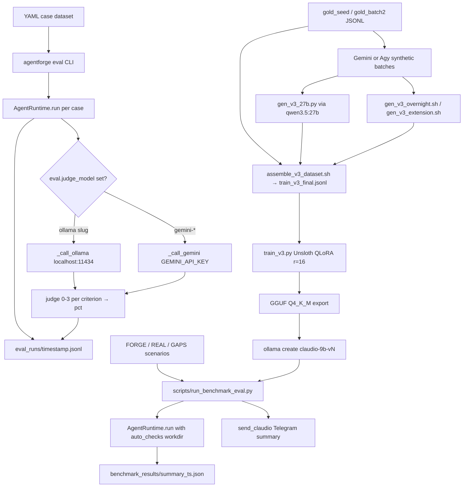

# Evaluation & Finetuning

AgentForge has two complementary quality loops. The **evaluation** side executes agents against case datasets and scored benchmark scenarios, and stores timestamped artifacts that can be replayed and diffed across model generations. The **fine-tuning** side turns those artifacts, plus synthetically generated examples, into LoRA fine-tunes of `Qwen/Qwen3.5-9B` via Unsloth that are exported as GGUF and re-registered with Ollama so the loop can be measured again.



*The evaluation loop on the left produces the LLM-judge and auto-check scores; the fine-tuning loop on the right turns synthetic + gold data into a LoRA adapter that is re-registered with Ollama and re-measured by the benchmark runner, closing the cycle.*

## Dataset Evaluation

### Running Evaluation

The eval entrypoint is the Typer command `eval` in `src/agentforge/cli/main.py`:

```bash
agentforge eval \
  --agent-dir agents/<id> \
  --dataset agents/<id>/eval_dataset.yaml
```

The CLI loads `AgentRuntime.from_agent_dir(agent_dir)`, opens the dataset, and writes one JSONL file per run to `agents/<id>/eval_runs/<UTC timestamp>.jsonl` (format `%Y%m%d-%H%M%S`). Each entry records the case index, input, raw output, notes, `latency_ms`, `timestamp`, and `ok`. A provider error on an individual case does not abort the run — the entry is written with `ok: false` and an `error` field, and the remaining cases still execute.

### Dataset Format

The dataset YAML has a top-level `cases` list. Every case has an `input` and an optional free-form `notes` field; `notes` is echoed into the JSONL but never enforced by the CLI. `agents/lab-ops/eval_dataset.yaml` is the canonical example, with 8 diagnostic cases covering health, top CPU consumers, free RAM, syslog errors, disk usage, service inventory, and uptime:

```yaml
cases:
  - input: "qual é o estado geral do servidor?"
    notes: "diagnóstico básico — espera resumo de CPU/memória/disco"
```

`agents/lab-ops/eval.yaml` is a separate, richer schema (`eval_version`, `agent_id`, `tests` with `expected.tool_executed`, `output_contains`, `history_length`, etc.) that is produced by the agent-generation spec pipeline rather than consumed by `agentforge eval`.

### LLM Judge

Automatic scoring is enabled per agent via the `eval` block of `agent.yaml`:

```yaml
eval:
  judge_model: "gemma4:e4b"
  criteria:
    - response based on real data
    - objective and actionable recommendation
    - no fabricated metrics
```

The `EvaluationSpec` model in `src/agentforge/core/agent_models.py` exposes `criteria: list[str]` and `judge_model: str | None`; the CLI activates the judge only when **both** are set (`use_judge = bool(judge_model and criteria)`). Each judge invocation goes through `score()` in `src/agentforge/eval/judge.py`.

#### Judge JSON contract

The prompt (`_JUDGE_PROMPT`) asks the model for a strict JSON object:

```json
{"scores": {"<criterion>": 0-3}, "total": sum, "max": total_possible,
 "pct": percentage, "justifications": {"<criterion>": "one sentence"}}
```

with `0 = absent or inadequate`, `1 = attempt with serious gaps`, `2 = satisfactory with minor flaws`, `3 = excellent`. The agent's output is truncated to 3000 characters before it is embedded in the prompt. If the model returns a ```-fenced block, the fence is stripped; if the response is not directly parseable JSON, the code scans from the first `{` to the last `}` and retries before giving up with `{"error": "judge parse failed", "raw": ...}`. `score()` recomputes `total` and `pct` itself (`total = sum(scores)`, `pct = round(total / (len(criteria)*3) * 100)`) rather than trusting the model's arithmetic, so the CLI only needs to read `pct` back.

#### Ollama vs Gemini routing

Routing is by **model slug prefix**:

```python
if judge_model.startswith("gemini-"):
    raw = _call_gemini(prompt, judge_model)
else:
    raw = _call_ollama(prompt, judge_model)
```

- **Ollama** path (`_call_ollama`): POSTs to `http://localhost:11434/api/generate` with `stream: false` and a 120 s timeout. Any non-`gemini-` slug — `gemma4:e4b`, `qwen3.5:9b`, etc. — goes here.
- **Gemini** path (`_call_gemini`): calls the `generativelanguage.googleapis.com/v1beta/models/{model}:generateContent` REST endpoint with `temperature: 0`, `maxOutputTokens: 512`, and a 60 s timeout.

### Judge credential resolution

`_call_gemini` looks for the key in this exact order:

1. `os.environ["GEMINI_API_KEY"]`
2. `os.environ["GEMINI_API_KEY_FOXVAULT"]`
3. The first `GEMINI_API_KEY*` line (any name starting with that prefix) in `~/.env.secrets`, split on the first `=`
4. Raises `RuntimeError("GEMINI_API_KEY not defined")` if none is found

`run_agent_on_scenario` catches judge exceptions separately from runtime errors, so a missing key only shows up as `{"error": ...}` inside the `judge` field of the JSONL entry; the run itself still succeeds.

### Eval summary line

After the loop, the CLI prints `N/M cases OK` and, if any judge invocations returned a `pct`, the integer average of those pcts.

## Benchmark Evaluation

### Benchmark Runner

`scripts/run_benchmark_eval.py` is a standalone runner (not part of the Typer CLI) that walks a list of benchmark scenario IDs, executes the corresponding `agents/<id>` against each scenario JSON, and scores the workdir + output + tool-call log with the scenario's `auto_checks`.

```bash
python3 scripts/run_benchmark_eval.py
python3 scripts/run_benchmark_eval.py --scenarios F3 P3
python3 scripts/run_benchmark_eval.py --model qwen3.5:9b --provider llamacpp
```

Scenarios come from three on-disk families mapped in `SCENARIO_MAP`:

- **FORGE** (`F1..F5`) — multi-turn, chained, autonomous work; scenarios live under `~/repos/estudo/forge/scenarios/`.
- **REAL** (`P1..P4`) — real-browser / real-test scenarios under `~/repos/estudo/real/scenarios/`.
- **GAPS** (`G1, G2, G4, G5`) — destructive-action / ambiguity regression scenarios under `gaps/scenarios/` in the repo.

Each scenario ID maps to a dedicated agent directory in `AGENT_MAP` (`agents/forge-f1`, `agents/real-p3`, `agents/gap-g1`, …). `DEFAULT_SCENARIOS` runs all 13.

### Per-scenario execution

For each scenario, `run_agent_on_scenario`:

1. Creates an isolated workdir `benchmark_results/<SID>/<model_slug>/run_<ts>/` and copies the scenario's `fixture_dirs` and `prd_file` (as `TASK.md`) into it.
2. Picks a random port in `[20000, 40000]` so `port_open` checks do not collide with production services.
3. Sets `AGENT_WORKDIR` and `AGENTFORGE_MODEL` in `os.environ`, then imports `AgentRuntime.from_agent_dir` and, if the scenario declares `max_turns` larger than the agent-spec `max_tool_cycles`, raises `runtime.runtime_config.max_tool_cycles` (never lowers it) so long FORGE tasks can run.
4. Runs the prompt and captures `output` plus `metadata.tool_calls_log`.
5. Evaluates the scenario's `auto_checks` against the workdir and writes `agentforge_<SID>_<model_slug>_<ts>.json` into the workdir.

### Auto-check types

`score_auto_checks` supports a fixed registry of weighted check types: `file_exists`, `file_not_exists`, `file_contains`, `file_contains_count`, `file_size_min`, `file_unchanged` (md5 vs. reference fixture), `json_valid`, `json_has_keys`, `python_syntax`, `python_tests_pass` (runs `pytest` with a 60 s timeout), `skill_has_frontmatter`, `skill_has_sections`, `response_contains`, `response_contains_any`, `tool_called`, `tool_call_url_contains`, `tool_call_result_contains`, `run_bash_command_contains`, `no_error`, `port_open`, `run_command_ok`. String-valued check fields support `{model_slug}`, `{port}`, `{workdir}` templating.

The `no_error` check uses word-bounded regexes (`(?<![A-Za-z])Error:`, `(?<![A-Za-z])Exception:`, plus `\b\[ERRO\]` and `Traceback`) because a bare substring match false-positives when the model legitimately quotes an error name inside a data report (confirmed 2026-07-20, REAL P2). `response_contains_any` is the OR variant for scenarios with multiple acceptable behaviors (e.g. the ambiguity gap scenario where a clarifying question or an explicit assumption declaration both pass, but silently guessing does not).

### Provider auto-management

Before running, the runner swaps containers depending on `--provider`:

- **`--provider llamacpp`**: stops the `ollama` docker container (VRAM conflict), sets `AGENTFORGE_PROVIDER=llamacpp`, and — unless `LLAMACPP_THINKING_BUDGET` is already set — sets it to `0` when the model slug contains `nothink` and `800` otherwise. The 2026-07-20 FORGE F5 regression (17.6 % with forced thinking vs. 100 % with thinking off, identical model/scenario/backend) is documented in the script's comment as the reason for this guard. `_wait_for_llamacpp_ready` then polls `LLAMACPP_HOST/health` (default `http://localhost:8082`) until it answers or 60 s elapse, because the container being "Up" is not the same as llama-server having bound its port.
- **Default (Ollama)**: stops the `turboquant` container instead.

After the run, the runner restores whichever container it stopped.

### Results

Per-scenario JSON results live in the isolated workdir. A run-level summary is written to `benchmark_results/summary_<ts>.json` with `model`, `scenarios`, `total_score`, `total_max`, `total_pct`, and the full per-scenario result list. Unless `--no-notify` is passed, each scenario result and the final `build_telegram_summary` (thresholds: ✅ ≥ 70 %, ⚠️ ≥ 40 %, ❌ below) are delivered through `agentforge.tools.send_claudio.send_claudio` — the same tool the runtime uses for its own notifications.

## Finetuning Pipeline

The fine-tuning work lives entirely under `finetune/` and is described in `docs/FINETUNING-STRATEGY.md`. The goal is to eliminate residual benchmark failures that no prompt reliably fixes (tool-name incoherence between impl and test, inconsistent error-message casing, missing confirmation phrases, `<tool_use>` XML leakage into textual output) by shifting the model's learned distribution rather than the harness.

### Directory layout

```
finetune/
├── dataset/                  # All JSONL datasets (gold, synthetic v1/v2/v3, traces)
├── gemini_synth/             # Gemini/Agy synthetic generation prompts and seed batches
├── scripts/                  # Generation, assembly, training, QA scripts
├── logs/                     # Timestamped gen / train / quantize logs
├── system_prompt.txt         # Canonical Cláudio system prompt (used by QA)
├── Modelfile                 # Ollama Modelfile for the exported Q4_K_M GGUF
└── run_train_notify.sh       # Training wrapper with Telegram completion notification
```

### Synthetic data generation

Three overlapping generation stacks feed the same `dataset/` pool:

1. **Gemini/Agy synth (`gemini_synth/`)** — `generate_dataset.py` and `generate_seeds_lote2.py` drive Gemini (through the `Agy` CLI, configured by `GEMINI.md`) to author JSONL examples directly. The AGY prompts (`AGY_AGENTFORGE.md`, `AGY_AGENTFORGE_V2.md`, `AGY_AGENTFORGE_V3.md`) are the canonical "what a good example looks like" specification and are reused by the overnight generators. `seeds_501_592.json` is a saved seed batch. `GEMINI.md` documents the batch plan (e.g. "claudio-g501 to claudio-g1420") and, critically, instructs the model to *write the JSONL itself* rather than call local models.
2. **Local 27b generation (`gen_v3_27b.py`)** — targets 300–500 examples in ~7 hours by calling `qwen3.5:27b` through the Ollama REST API one example at a time (per-call validation + retry with prompt variation). Categories are weighted: `create_then_use` (35), `tool_discovery` (30), `general_reasoning`.
3. **Overnight Agy batches (`gen_v3_overnight.sh` / `gen_v3_extension.sh`)** — 15 batches of 20 examples each (300 total) plus a 25-batch extension to 500, each batch calling `agy --print-timeout 18m` with a category-specific prompt assembled from the `AGY_AGENTFORGE_V3.md` spec and per-batch `EXTRA_RULES`. Batches target specific behaviors: `write_large_file_site`, `write_large_file_report`, `code_review_report`, `pytest_sqlite_isolation`, `schema_driven_use`, `tool_discovery`, `create_then_use`, `error_recovery_tool`, `general_reasoning`. Failed batches sleep 90 s and continue.

`qa_dataset.py` is the pre-training gate: it validates every JSONL line against the canonical schema (required fields `id`, `category`, `subcategory`, `difficulty`, `source`, `messages`), category/subcategory whitelists, markdown-free assistant text, minimum/maximum assistant and tool-result lengths, and the canonical system prompt from `system_prompt.txt`. `--fix` rewrites the system prompt on in-place; without it the script emits a review report.

### Dataset assembly

`assemble_v3_dataset.sh` concatenates a fixed mix of sources into `dataset/train_v3_final.jsonl` (the single file the trainer consumes). The target composition is documented in the header:

| Source | Count | Role |
|--------|-------|------|
| `synth_agentforge_v2.jsonl` + `synth_agentforge_batch1.jsonl` + `synth_claude_batch9.jsonl` | ~1620 | Core AgentForge behavior (must_rules, chains, guardrails) |
| Sampled from `synth_gemini*.jsonl`, `synth.jsonl`, `synth_claude_batch*.jsonl` | 700 | Schema diversity for generalization (seeded with `random.seed(42)`) |
| Sampled no-tool chat + refusal | 400 | Prevents catastrophic forgetting |
| `gold_seed.jsonl` + `gold_batch2.jsonl` | 100 | High-quality multi-turn gold |
| `synth_v3_overnight.jsonl` (overnight + extension) | 300 | New v3 gap + generalization categories |
| `synth_v3_27b.jsonl` | 400 | `create_then_use` + discovery from qwen3.5:27b with real code |
| **Total** | **~4020** | |

### Training (`train_v3.py`)

The v3 trainer is an Unsloth + TRL SFTTrainer script:

- **Base model**: `Qwen/Qwen3.5-9B`, loaded with `load_in_4bit=True` (QLoRA). Deliberately starts from the base, not from a previous v2 adapter.
- **LoRA**: `r=16`, `alpha=32` (2× r), dropout 0.05, targets `q_proj/k_proj/v_proj/o_proj` + `gate_proj/up_proj/down_proj`.
- **Sequence / batching**: `max_seq_length=6144` (raised from 4096 because FORGE F5 needs longer context), `per_device_batch_size=1`, `gradient_accumulation_steps=16` (effective batch 32 across 2 GPUs), `packing=True`.
- **Schedule**: 2 epochs (down from v2's 4), `lr=1e-4` (down from `2e-4`), `warmup_ratio=0.10`, cosine schedule, weight decay 0.01, bf16 if supported.
- **Validation**: examples with malformed `tool_calls[].function.arguments` JSON are skipped; `arguments` is parsed back to a dict before `apply_chat_template` (the Qwen chat template expects a dict, not a string).
- **Smoke test**: `--smoke-test` runs 20 examples / 5 steps without saving, so the pipeline can be checked before committing to a ~4 h run.
- **Output**: LoRA adapter + tokenizer under `output/<name>/`, plus a `Q4_K_M` GGUF in `output/<name>/gguf/` via `model.save_pretrained_gguf`. The final print tells you to register it with `ollama create <name> -f <run_dir>/gguf/Modelfile`.

The v2 → v3 hyperparameter changes are documented in the module docstring as the direct response to v2's catastrophic forgetting (base model scored 85 % on the benchmark; v2 only 67 %). `train_v2.py` and `train.py` remain in `scripts/` for the earlier pipelines.

### Ollama registration and notify wrapper

`finetune/Modelfile` is the Ollama manifest for the exported GGUF:

```
FROM ./output/claudio-9b-v1/gguf/claudio-9b_gguf/Qwen3.5-9B.Q4_K_M.gguf
TEMPLATE {{ .Prompt }}
RENDERER qwen3.5
PARSER qwen3.5
PARAMETER temperature 0.3
...
SYSTEM """Você é Cláudio, assistente pessoal do Conrado..."""
```

The `SYSTEM` block embeds the Cláudio persona (fox-server environment, `read_link`/`run_bash` tools, plain-text no-markdown output rules, no-destructive-action rule) so the fine-tuned model is registered as a *different persona* from the base Qwen, not just a weight delta.

`run_train_notify.sh` wraps the training run for unattended operation: it stops the user-level `ollama-warmup.service` to free VRAM, sends a Telegram "training started" message via a token read from `~/.aurelia/config/app.json`, runs `scripts/train.py` with output teed to a timestamped log under `logs/`, and on completion parses the final loss and GGUF path out of the log to include in the Telegram summary. On failure it ships the last 5 log lines. The wrapper then restarts `ollama-warmup.service` regardless of outcome.

### Evaluating a fine-tuned model

A new fine-tune is measured with the same benchmark runner as the base model:

1. `ollama create claudio-9b-vN -f finetune/output/claudio-9b-vN/gguf/Modelfile`
2. `python3 scripts/run_benchmark_eval.py --model claudio-9b-vN`
3. Compare `benchmark_results/summary_*.json` totals across model slugs; per-check `details` in each scenario JSON identify which specific behaviors regressed or improved.

`finetune/logs/` retains every generation and training log with the timestamped name used by the scripts (`gen_v3_*.log`, `train_*.log`, `quantize_*.log`), which is the reproducibility audit trail for a specific `summary_*.json`.

## Key Files

| File | Role |
|------|------|
| `src/agentforge/cli/main.py` | `agentforge eval` Typer command, `eval_runs/` writer, judge wiring |
| `src/agentforge/eval/judge.py` | `score()`, Ollama/Gemini routing, JSON contract parsing |
| `src/agentforge/core/agent_models.py` | `EvaluationSpec` (`judge_model`, `criteria`) on the agent spec |
| `scripts/run_benchmark_eval.py` | FORGE/REAL/GAPS scenario runner, auto-checks, provider swap |
| `finetune/scripts/train_v3.py` | Current Unsloth QLoRA trainer (r=16, seq 6144) |
| `finetune/scripts/assemble_v3_dataset.sh` | Builds `train_v3_final.jsonl` from all sources |
| `finetune/scripts/gen_v3_27b.py` | Local `qwen3.5:27b` synthetic generation (Ollama REST) |
| `finetune/scripts/gen_v3_overnight.sh` | Agy overnight 15-batch v3 generator |
| `finetune/scripts/gen_v3_extension.sh` | Agy 25-batch v3 extension (schema/discovery focus) |
| `finetune/scripts/qa_dataset.py` | Pre-training dataset QA and `--fix` |
| `finetune/scripts/train.py` / `train_v2.py` | Earlier training pipelines (kept for reference) |
| `finetune/gemini_synth/generate_dataset.py` | Gemini-driven batch synthesis for `synth_gemini*.jsonl` |
| `finetune/gemini_synth/AGY_AGENTFORGE_V3.md` | Canonical v3 generation spec reused by overnight scripts |
| `finetune/gemini_synth/GEMINI.md` | Gemini/Agy batch plan and self-generation instructions |
| `finetune/Modelfile` | Ollama manifest for the exported GGUF |
| `finetune/run_train_notify.sh` | Telegram-notified training wrapper |
| `docs/FINETUNING-STRATEGY.md` | Strategy doc: motivation, phase plan, LoRA config |
