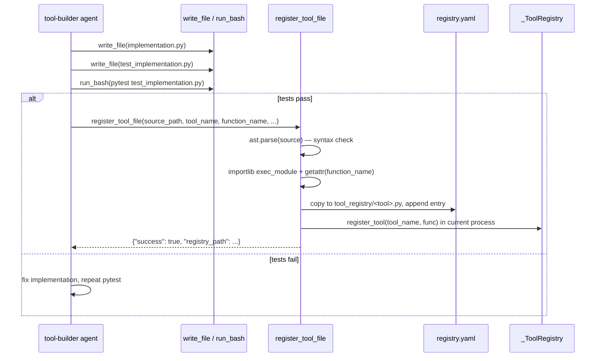

# Tool System

## Overview

The tool system is AgentForge's mechanism for giving agents the ability to interact with the outside world — read files, execute commands, call APIs, send messages, and even create new tools.

Tools are stored in a single process-wide registry and exposed to models as OpenAI-compatible function schemas. Registration happens in two phases at interpreter startup: all builtin tools are registered first, then agent-generated dynamic tools are loaded from `tool_registry/`, so builtins (including the self-registration tool itself) are always present before any dynamic tool shadows or extends them.

## Tool Registry

**Location**: `src/agentforge/tools/registry.py`

The registry is a module-level dict created at import time:

```python
_ToolRegistry: dict[str, Callable] = {}
```

Key operations:

| Function | Description |
|----------|-------------|
| `register_tool(name, func, **default_kwargs)` | Register a callable; wraps it in `functools.partial` when default kwargs are given |
| `get_tool(name)` | Retrieve a callable by name |
| `execute_tool(name, **kwargs)` | Execute a tool, returning its result, `{"error": ...}` on `TypeError`, or `None` if the name is unknown |
| `list_tools()` | List all registered tool names |
| `_register_builtin_tools()` | Register all builtins and then trigger dynamic loading |

`register_tool` injects default kwargs via `functools.partial` — for example `read_log_tail` is registered with `log_path="/var/log/syslog"` pre-bound, so callers may omit it. `execute_tool` merges partial-bound keywords with caller-supplied keywords when invoking a wrapped builtin, and swallows `TypeError` into a JSON error dict rather than raising.

`_register_builtin_tools()` runs at module import (the file ends with a call to it), so importing `agentforge.tools.registry` is what populates the registry. The engine does not call any explicit init function.

### Built-in Tools

Registered in `_register_builtin_tools()`:

| Tool | File | Description |
|------|------|-------------|
| `collect_system_health` | `system_health.py` | CPU, memory, disk, GPU, process metrics (psutil, Linux) |
| `collect_wks_health` | `wks_health.py` | Windows workstation health via the fox-wks worker |
| `read_log_tail` | `read_log_tail.py` | Last lines of a log file; `log_path` defaults to `/var/log/syslog` |
| `scan_directory` | `vault_scan.py` | Directory scanning in the vault workspace |
| `extract_file_content` | `vault_extract.py` | Extract file content from the vault |
| `run_agent` | `run_agent.py` | Multi-agent delegation to a worker agent |
| `http_get` | `http_get.py` | HTTP GET request |
| `write_file` | `write_file.py` | Write content to a file under `AGENT_WORKDIR` |
| `read_file` | `write_file.py` | Read a file (8000-char truncation) |
| `append_file` | `write_file.py` | Append to a file |
| `run_bash` | `run_bash.py` | Bash execution in `AGENT_WORKDIR` with a destructive-command blocklist |
| `send_claudio` | `send_claudio.py` | Send a notification via the Claudio Telegram bot |
| `fetch_social_url` | `fetch_social.py` | Fetch a social-media URL |
| `register_tool_file` | `register_tool_file.py` | Register a new Python tool at runtime (Voyager pattern) |
| `tts_omnivoice` | `tts_omnivoice.py` | Text-to-speech via OmniVoice |
| `heygen_credits` | `heygen_mcp.py` | HeyGen account credits check |
| `heygen_video_agent` | `heygen_mcp.py` | HeyGen Video Agent pipeline (fire-and-forget) |
| `heygen_get_agent_session` | `heygen_mcp.py` | Poll a Video Agent session |
| `heygen_video_creator` | `heygen_mcp.py` | Create a video from an avatar + audio or text script |
| `heygen_upload_audio` | `heygen_mcp.py` | Upload a local WAV/MP3 to HeyGen assets |
| `heygen_upload_image` | `heygen_mcp.py` | Upload a local PNG/JPG to HeyGen assets |
| `heygen_create_photo_avatar` | `heygen_mcp.py` | Create a photo avatar from an image |
| `heygen_poll_avatar_ready` | `heygen_mcp.py` | Poll avatar training until ready |
| `heygen_list_avatars` | `heygen_mcp.py` | List HeyGen avatar groups |
| `heygen_get_video` | `heygen_mcp.py` | Poll video status/URL by video_id |
| `heygen_wallet_report` | `heygen_wallet.py` | Report HeyGen credit spend and projections |

Note that the registry import for `read_file` comes from `write_file.py` (the module containing `write_file`, `read_file`, and `append_file` together); a separate `src/agentforge/tools/read_file.py` also exists on disk with its own `read_file` implementation, but it is not what the registry binds.

### Tool Registration Order

`_register_builtin_tools()` registers the builtin catalogue in a fixed order (health tools, log tail, vault tools, `run_agent`, `http_get`, file tools, `run_bash`, `send_claudio`, `fetch_social_url`, `register_tool_file`, `tts_omnivoice`, then the HeyGen MCP and wallet tools). After the last builtin it calls `load_dynamic_tools()`, which loads agent-generated tools from `tool_registry/` into the same dict.

This ordering guarantees that:

1. `register_tool_file` itself is a builtin and is always available, so any agent can invoke it in the same process that created the tool.
2. Dynamic tools never overwrite builtins at startup (they are appended after the builtin pass).
3. The tool-builder flow — write implementation, write tests, run pytest, register — works within a single agent session because `register_tool_file` registers the new tool in the *current* process immediately, while persisting it to `tool_registry/` for every future session.

## Dynamic Tool Loader

**Location**: `src/agentforge/tools/dynamic_loader.py`

`load_dynamic_tools()` reads `tool_registry/registry.yaml`, and for each entry:

1. Locates `tool_registry/<file>` (default `<name>.py`).
2. Loads it as a fresh module keyed `_agentforge_dynamic_<name>` in `sys.modules` via `importlib.util.spec_from_file_location`.
3. Binds the entry's `function` (default `<name>`) into the registry under the entry's `name`.

Failures are silent by design: missing files, unparseable YAML, import errors, or missing functions each cause that one entry to be skipped (`continue`) or the whole load to return `[]` — a corrupted `tool_registry/*.py` produces no log line and no error at startup, only the absence of the tool. There is no per-entry error reporting to the operator.

The manifest `tool_registry/registry.yaml` is the single source of truth for dynamic tools. As of this repository snapshot it contains nine entries, including `search_memory` (created by `tool-builder+human-fix`), four `browser_*` tools, `buscar_precos_br`, and two `comfyui_*` tools. The registry is deliberately not hand-edited; `register_tool_file` is the only writer.

## Tool Self-Registration (Voyager Pattern)

**Location**: `src/agentforge/tools/register_tool_file.py`

Agents can create new tools at runtime. The canonical flow (implemented by the `tool-builder` agent in `agents/tool-builder/`) is:



Caption: The Voyager self-registration loop — the agent writes code and tests in `AGENT_WORKDIR`, validates with pytest, then commits the tool to the persistent registry.

`register_tool_file(source_path, tool_name, function_name, description, input_schema, created_by)` runs three validations before touching the registry:

1. **File exists** — `source_path` resolved against `AGENT_WORKDIR` (absolute paths pass through).
2. **Syntax is valid Python** — `ast.parse` on the file.
3. **Module imports and the named function exists** — `importlib` loads the file as `_agentforge_validate_<tool_name>` and `getattr(module, function_name)` must return a callable.

On success it copies the file to `tool_registry/<tool_name>.py`, appends (or replaces the same-named) entry in `tool_registry/registry.yaml` with `name`, `file`, `function`, `description`, `input_schema`, `created_by`, and an ISO-8601 UTC `registered_at`, and then registers the loaded function in the live `_ToolRegistry` so it is callable in the current process without restarting. Any validation failure returns `{"success": false, "error": "<reason>"}` and leaves the registry untouched.

Because registration replaces any existing entry with the same `name`, re-registering overwrites the prior version — there is no version history. The tool-builder agent's guardrails (`must`: re-read the implementation before writing tests, run pytest before registering; `must_not`: register with failing tests or claim pytest passed when it did not) are the primary safeguard against a bad tool entering the registry.

## Tool Spec in Agent Spec

Tools available to an agent are declared in `agent.yaml` under `tools:` and modelled by the `ToolSpec` Pydantic model in `src/agentforge/core/agent_models.py`:

```yaml
tools:
  - name: collect_system_health
    required: true
    description: "Collects CPU, RAM, disk, and GPU metrics"
    when_to_use: "Whenever the user asks about server status"
    when_not_to_use: "Do not use for questions about specific logs"
    input_schema: '{"type":"object","properties":{},"required":[]}'
```

Fields:

- `name` — the key in `_ToolRegistry`; must match a registered tool
- `required` — when true, the engine calls the tool once with no args at the start of every `run()` and folds the result into the user input before the model sees anything
- `description` — the base description shown to the model
- `category` / `status` — organizational metadata (`stable` | `optional` | `experimental`)
- `when_to_use` / `when_not_to_use` — appended to the description as "Use when: …" / "Do not use when: …" hints
- `input_schema` — JSON-schema string for the model's arguments; malformed JSON falls back to an empty object schema rather than raising
- `output_schema` — expected output format description (documentation only, not enforced)

## Tool Schema to Model

`AgentRuntime._build_tools_schema()` converts the `ToolSpec` list to the OpenAI/Ollama function-calling shape:

```python
schema.append({
    "type": "function",
    "function": {
        "name": tool.name,
        "description": description,  # base + " Use when: " + " Do not use when: "
        "parameters": params,        # json.loads(input_schema) or {} object schema
    },
})
```

If `agent_spec.workflow.agents` is non-empty, `_build_tools_schema()` additionally appends a single synthetic `run_agent` entry whose description lists every declared worker's `name`, `agent_dir`, and description — the model picks a worker by reading that list. This is how multi-agent delegation becomes visible to the model without the orchestrator hardcoding worker names into its prompt.

The engine executes a model-issued tool call through `AgentRuntime._execute_tool` → `execute_tool(name, **args)` from the registry, and folds the resulting JSON back into the conversation for the next turn.

## Special Tools

### run_agent (Multi-Agent Delegation)

**Location**: `src/agentforge/tools/run_agent.py`

```python
def run_agent(agent_dir: str, input: str) -> dict:
    from agentforge.runtime.engine import AgentRuntime  # lazy — avoids circular import
    runtime = AgentRuntime.from_agent_dir(agent_dir)
    result = runtime.run(input)
    return {"agent_id": result["agent_id"], "output": result["output"]}
```

The import is deliberately lazy so that `agentforge.tools.registry` (which imports `run_agent` at startup) does not cycle back into `agentforge.runtime.engine`. Each call constructs a fresh `AgentRuntime` for the worker; there is no worker cache, so repeated delegation pays the full spec-load cost each time. The orchestrator receives only `agent_id` and `output` and synthesizes across workers itself.

### run_bash (with Guardrails)

**Location**: `src/agentforge/tools/run_bash.py`

`run_bash(command)` executes a shell command in `AGENT_WORKDIR` (created on demand) with three safety layers:

1. **Destructive blocklist** — `_BLOCKLIST` is a list of regexes searched against the lower-cased command string. Blocked patterns include `rm -rf`/`rm -fr` (any letter ordering between `rm` and the flags), the `:(){` fork-bomb, `dd if=/dev/…`, `mkfs`, `fdisk`, `> /dev/sd*` redirection, `wget … | bash` / `curl … | bash` / `curl … | sh`, `chmod 777 /`, `sudo rm`, `shutdown`, and `reboot`. A hit returns `[BLOCKED] Command not allowed (pattern: <pattern>).` without executing anything. The check is a plain `re.search` over the whole command line, so it can be bypassed by shell obfuscation — it is a guardrail, not a sandbox.
2. **Timeout** — `BASH_TIMEOUT` env var (default `1800` seconds). On `subprocess.TimeoutExpired` the process is killed and `[ERROR] Timeout after <N>s.` is returned.
3. **Output handling** — stdout/stderr are written to a `tempfile.TemporaryFile()` rather than a pipe. This is a deliberate regression fix (2026-07-21): `subprocess.run(capture_output=True)` hangs until the full `BASH_TIMEOUT` whenever the command backgrounds a longer-lived child (e.g. `python3 -m http.server &`) because the grandchild keeps the pipe's write end open. A regular file has no blocking-reader semantics, so `Popen.wait()` returns as soon as the shell we launched exits. Output is truncated to 4000 chars with a `… [truncated — N chars total]` marker; empty output becomes `(no output)`.

The command is run with `shell=True, cwd=AGENT_WORKDIR, start_new_session=True`; `tests/test_run_bash.py` covers the empty-command error, blocklist hit on `rm -rf /`, nonzero-exit stderr capture, the backgrounded-server regression (asserting the call returns in well under the 1800s window), and the timeout on a genuinely slow foreground command.

### write_file / read_file / append_file

**Location**: `src/agentforge/tools/write_file.py`

All three resolve relative paths against `AGENT_WORKDIR` (falling back to `.` when the env var is unset) and create parent directories on write/append. `read_file` truncates to 8000 chars with the same truncation marker as `run_bash`. These tools are the primary persistence mechanism agents use for reports, intermediates, and — critically — for the tool-builder's implementation and test files that later flow into `register_tool_file`.

### `AGENT_WORKDIR`

Every filesystem-scoped tool (and the engine's `guardrails.must` filename checks) treats `AGENT_WORKDIR` as its scope. The convention, taken independently in each tool module, is `Path(os.environ.get("AGENT_WORKDIR", ".")).resolve()`; the env var is a single deployment-wide switch that decides where an agent can read, write, and execute. The engine's `must`-compliance check (`_check_must_compliance`, `_missing_must_files`) uses the same workdir to verify that filename-shaped quoted terms in `guardrails.must` actually exist on disk before a run is considered compliant, so the same env var scopes both the tools and the guardrail validator. `heygen_mcp.py`, `tts_omnivoice.py`, and `register_tool_file.py` also resolve their local-file arguments against it, keeping "the agent's files" as one consistent notion across the whole tool surface.

### send_claudio

**Location**: `src/agentforge/tools/send_claudio.py`

Sends notifications via the Claudio Telegram bot. Used by agents to push alerts when tasks complete or anomalies are detected.

### HeyGen Tools

**Location**: `src/agentforge/tools/heygen_mcp.py`, `heygen_wallet.py`

A collection of HeyGen API tools for video generation, avatar creation, and wallet management, all routed through HeyGen's MCP endpoint (`https://mcp.heygen.com/mcp/v1/`) with OAuth 2.0 tokens persisted to `~/.agentforge/mcp_tokens/heygen.json` via the shared `agentforge.channels.mcp_client.call_mcp_tool` helper. Two controls shape behaviour:

- **`AGENTFORGE_HEYGEN_SANDBOX`** — a code-level kill switch (env var, not a per-agent `tools.yaml` entry) that blocks or forces `test_mode` on any paid HeyGen call, so a misconfigured agent cannot incur real charges even if it picks the wrong tool.
- **Wallet tracking** — `heygen_video_creator` and `heygen_video_agent` snapshot `heygen_credits()` before creating, then call `wallet_record_creation` in `heygen_wallet.py`; when `heygen_get_video` later reports `status=completed` it calls `wallet_record_completion`, computing `credits_spent = max(0, credits_before - credits_after)` and persisting to `~/.agentforge/heygen_wallet.json`. `heygen_wallet_report` exposes the summary, average, and monthly projection. Test-mode videos are *not* free — the wallet still records them.

### Vault Tools

**Location**: `src/agentforge/tools/vault_scan.py`, `vault_extract.py`

Tools for scanning and extracting content from the vault workspace. Used by the vault-pilot agent, whose `required` tool entry drives the engine's pre-model input enrichment (the engine also special-cases `vault-pilot` when folding the required tool's result into the prompt).

### system_health vs wks_health

| Tool | Target | Source |
|------|--------|--------|
| `collect_system_health` | Linux servers | `system_health.py` — psutil-based metrics |
| `collect_wks_health` | Windows workstations | `wks_health.py` — fox-wks worker integration |

## Source References

| File | Role |
|------|------|
| `src/agentforge/tools/registry.py` | Global tool registry, builtin registration, dynamic-load trigger |
| `src/agentforge/tools/dynamic_loader.py` | Load tools from `tool_registry/registry.yaml` |
| `src/agentforge/tools/register_tool_file.py` | Voyager self-registration |
| `src/agentforge/tools/run_agent.py` | Multi-agent delegation |
| `src/agentforge/tools/run_bash.py` | Bash execution with blocklist and timeout |
| `src/agentforge/tools/write_file.py` | `write_file` / `read_file` / `append_file` in `AGENT_WORKDIR` |
| `src/agentforge/tools/read_file.py` | Alternative `read_file` implementation (not bound by the registry) |
| `src/agentforge/tools/http_get.py` | HTTP GET |
| `src/agentforge/tools/system_health.py` | Linux system health metrics |
| `src/agentforge/tools/wks_health.py` | Windows workstation health |
| `src/agentforge/tools/read_log_tail.py` | Log file tail |
| `src/agentforge/tools/send_claudio.py` | Telegram notification |
| `src/agentforge/tools/fetch_social.py` | Social media URL fetching |
| `src/agentforge/tools/tts_omnivoice.py` | Text-to-speech |
| `src/agentforge/tools/heygen_mcp.py` | HeyGen MCP tools |
| `src/agentforge/tools/heygen_wallet.py` | HeyGen credit wallet |
| `src/agentforge/tools/vault_scan.py` | Vault directory scanning |
| `src/agentforge/tools/vault_extract.py` | Vault file extraction |
| `src/agentforge/runtime/engine.py` | `_build_tools_schema`, `_execute_tool`, `run()` tool enrichment |
| `tool_registry/` | Dynamically registered tools (e.g. `search_memory.py`, `browser_*.py`, `comfyui_*.py`) |
| `tool_registry/registry.yaml` | Tool registry manifest |
| `agents/tool-builder/` | Agent specialized in creating and registering tools |
| `tests/test_run_bash.py` | Guardrail and timeout tests for `run_bash` |
