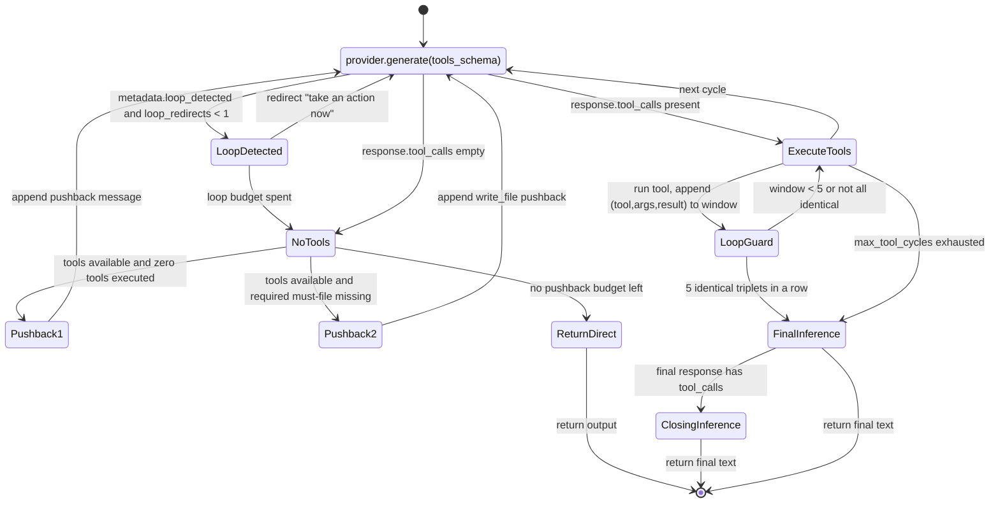

# Execution Pipeline

## Overview

The execution pipeline is implemented in `AgentRuntime.run()` within `src/agentforge/runtime/engine.py`. It orchestrates the full lifecycle of an agent run: from loading persisted history and injecting guardrail rules into the input, through the tool-calling cycle and guardrail checks, to memory persistence and the final result dict plus `runs.jsonl` log entry.

The runtime is constructed per agent directory via `AgentRuntime.from_agent_dir()`, which loads `agent.yaml` (the `AgentSpec`), `runtime.yaml` (flattened into `RuntimeConfig`), and an optional `tools.yaml` (list of `ToolSpec`). All per-run behaviour — provider, model, workflow mode, tool cycles, reflection, memory — is configured there.

## Pipeline Stages

```
run(input_text)
  │
  ├─ 0. Load persisted history (multi-turn only) at __init__ time
  │
  ├─ 1. Input preparation
  │     ├── Inject guardrails.must rules into the user input
  │     ├── Execute required tool (ToolSpec.required) → embed result in input
  │     └── Optional intent hooks: read_log_tail, extract_file_content
  │
  ├─ 2. Tool calling cycle (respond_or_tool mode)
  │     ├── Inference with tool schema
  │     ├── Pushback: redirect model to use tools
  │     ├── Execute tool calls
  │     ├── Loop guard: detect stuck cycles
  │     └── Exhaust cycles → final inference
  │
  ├─ 3. Reflection (if rounds > 0) — N rounds of self-critique
  │
  ├─ 4. Guardrails
  │     ├── must_not: auto-correct violations (up to 2 retries)
  │     └── must: deterministic phrase/file check + LLM judge
  │
  ├─ 5. Memory persistence (if multi-turn)
  │     ├── apply_window() (truncate or summarize)
  │     └── save_history()
  │
  └─ 6. Return result dict + append runs.jsonl
```

## Stage 1: Input Preparation

Before any model call, `run()` prepares the effective user input:

- **Rule injection.** `_inject_rules_to_input()` appends a `### MANDATORY RULES FOR THIS TASK:` block listing every `guardrails.must` rule to the user input, so the model sees its obligations in-context (parity with the REAL framework).
- **Required tool execution.** If any `ToolSpec` in the agent's `tools.yaml` has `required: true`, that tool is executed up front (no arguments) and its result is embedded into the input inside `<tool_results>` XML tags. This gives the model deterministic context (e.g. system health data) without a round-trip tool call.
- **Intent hooks.** Two legacy keyword detectors run against the raw input: log-related keywords trigger `read_log_tail` (with a path guessed from the input), and content-extraction keywords trigger `extract_file_content` for a filename found in the input. Both embed their results in the input the same way.

The system prompt is read from `system_prompt.md` in the agent directory (generated from the spec) and passed as `system_prompt` on every provider request.

## Stage 2: Tool Calling Cycle

### Mode: `respond_or_tool`

When `workflow.mode` is `respond_or_tool`, `run()` delegates to `_run_tool_calling_cycle()`, which runs up to `max_tool_cycles` (default 3, from `workflow.max_tool_cycles`) inference rounds against the provider with the full tool schema built by `_build_tools_schema()`.

The cycle has three distinct redirect budgets, each with its own counter and message:

- **`no_tool_redirects` (max 2).** If the model responds with text but no tool call *and zero tools have been executed yet*, the engine appends the response as an assistant message plus a user message: "You have not used any tools yet. Do NOT output code or text directly — use the available tools to complete the task. Call the appropriate tool now to proceed." — and continues the loop.
- **Missing required file redirect (shares the 2-budget above).** Once some tools have been executed, the generic pushback gate is permanently silent. A second gate (`_missing_must_files()`) checks whether filename-shaped quoted terms from `guardrails.must` (e.g. `'report.md'`) are still missing on disk relative to `AGENT_WORKDIR`. If so, the model gets one redirect explicitly telling it to call `write_file` for those files instead of describing them as text.
- **`loop_redirects` (max 1).** If the provider itself flags `loop_detected` in the response metadata (currently emitted by the llama.cpp provider when the model rambles without committing an action), the model is told to stop planning and either call a tool or give a short final answer.

Each round the engine always appends the assistant turn that requested tool calls (even with empty `content`) before executing them — omitting it produces invalid `[user, tool]` sequences that make qwen3.5 return empty responses.

### Loop Guard

After each executed tool call, the engine appends a key `f"{tool_name}:{sorted-args-json}::{result-json}"` to a sliding window `_STUCK_WINDOW = 5`. When the window is full and all 5 entries are identical, the cycle is aborted as a stuck loop.

Key detail: the key includes the **result**, not just tool + args. This lets legitimate polling of async operations survive — e.g. `heygen_get_agent_session` repeated with the same `session_id` is expected, and its result changes as the job progresses (status, messages, `video_id`). A true stuck loop (same call, same *unchanged* result, 5 in a row) is still caught. The comparison is on stringified JSON, so it works across any tool whose result is serializable via `json.dumps(..., default=str)`.

### Final Inference

When cycles are exhausted or a loop is detected, the engine performs a final inference:

- Appends a `completion_hint` user message summarizing all tools executed (name + 80-char args preview) — "Produce your final response based on the tools executed above".
- If `guardrails.must` rules contain quoted phrases, up to 3 of them are appended as "Your response MUST include: ..." so the final text is steered toward the required phrases.
- Calls `provider.generate` with the full message history **and** the tool schema still attached (a change from the earlier design, which omitted tools and physically prevented the model from calling `write_file` in its final turn). If the model returns tool calls, they are executed and a closing inference (no tools) produces the final text.

`_run_tool_calling_cycle()` returns `(output_text, tool_results_log, cycle_messages)` — the third element is the full accumulated message history including every tool call and result, not just a collapsed text summary. Callers that continue the conversation (the must-compliance retry below) must chain from this, otherwise the model loses file contents it already read.

### Tool Schema Construction

`_build_tools_schema()` converts `ToolSpec` objects to OpenAI/Ollama function format:

- For each tool: `type: "function"` with `function.name`, `function.description`, `function.parameters`.
- `when_to_use` / `when_not_to_use` are appended to the description as "Use when: ..." / "Do not use when: ..." decision hints.
- `input_schema` (a JSON string) is parsed into the `parameters` field; on parse failure an empty object schema is used.
- If the agent declared workers (`workflow.agents`), a synthetic `run_agent` tool is appended whose description lists every available worker (`name`, `agent_dir`, description) with required args `agent_dir` and `input`. At runtime `run_agent` (see `src/agentforge/tools/run_agent.py`) constructs a fresh `AgentRuntime.from_agent_dir(agent_dir)` and runs the delegated input, returning `{agent_id, output}`.

### Ollama-Specific Handling

The `OllamaProvider` in `src/agentforge/providers/ollama.py` has several special handling paths that the pipeline depends on:

1. **`think: False`**: always sent in chat payloads to disable Qwen3 thinking mode (avoids empty `message.content`).
2. **Thinking fallback**: if `message.content` and `message.tool_calls` are both empty but `message.thinking` has text, the thinking text is used as output.
3. **Regex fallback for tool calls**: if the API returns no `tool_calls`, two regex patterns try to extract tool calls from the output text — a `tool_name({"arg": "val"})` function-call pattern, and a JSON-block pattern for objects with `name`/`arguments` or `tool`/`args` fields.
4. **Malformed-history protection**: if the final message has neither text nor tool calls, the provider raises `OllamaResponseError` with a hint pointing at history shape (the engine's "always append the assistant tool-call turn" rule is what prevents this).

### Mode: Non-tool-calling

For any `workflow.mode` other than `respond_or_tool`, `run()` makes a single `provider.generate()` call with the prepared input, system prompt, and history, and uses `response.output_text` directly. `raw_response` is stripped of its `context` key for single-turn runs before being stored in the result.

## Stage 3: Reflection

If `workflow.reflection_rounds > 0`, `_reflect()` runs N sequential, stateless self-critique rounds: each round sends the original input plus the current output to the model with the prompt "Is it complete and accurate? Does it respect all role restrictions? Can it be more objective or useful?" and replaces the output with the response. Reflection happens *before* guardrail checks, so guardrails always see the final reflected text.

## Stage 4: Guardrails

Guardrails are declared in `agent.yaml` under `guardrails.must` (mandatory rules) and `guardrails.must_not` (forbidden behaviours). They are checked differently because they fail differently.

### must_not Rules (Auto-Correct)

`_apply_guardrails()` runs after the main output (and again after each must-compliance retry) whenever `must_not` is non-empty:

1. Determine the content to check. If the agent persisted output via a `write_file` tool call, the *file content* (`args.content` of the last `write_file` in the log) is checked, not the chat-level output text — otherwise a `write_file`-based agent would get "corrected" only in memory while the file on disk keeps the violation.
2. Ask the judge model (`_judge_model()`, overridable via `AGENTFORGE_JUDGE_MODEL`, falling back to `model_default`) which `must_not` rules the content violates.
3. If violations are found, send a correction prompt (listing the violated rules, the original question, and the offending content) and re-generate — up to `max_retries=2`. Each attempt re-checks; the loop exits early when clean.
4. If the content came from `write_file`, the corrected text is re-written to disk via `write_file` with a `"cycle": "guardrail_correction"` log entry, and the chat output text is left unchanged (the file is the deliverable). Otherwise the corrected text replaces the output.
5. Remaining violations (after all retries) are returned and recorded in `metadata.guardrail_violations`.

The judge model is deliberately decoupled from the candidate model under test via `AGENTFORGE_JUDGE_MODEL`: letting an unstable candidate judge its own output has been observed to contaminate the judgment (the judge call itself looped, filling the context window).

### must Rules (Compliance Check with Retries)

`_check_must_compliance()` is called from a retry loop in `run()` — up to `_MAX_MUST_COMPLIANCE_RETRIES = 3` attempts, re-checking after each correction. Each check classifies every `must` rule:

1. **Filename rules** (quoted terms matching `^[\w.-]+\.[A-Za-z0-9]{1,5}$`): authoritative and mandatory (AND semantics) — satisfied only if every such file actually exists on disk under `AGENT_WORKDIR`. Other quoted words in the same rule are ignored for this determination.
2. **Quoted-phrase rules** (non-filename quoted terms): deterministic case-insensitive substring match against the output text and the *full* (untruncated) tool execution evidence.
3. **Tool-mention rules** (no quotes, but the rule text names a tool that actually appears in `tool_results_log`): satisfied deterministically, the judge is skipped. This avoids false negatives on expensive real tool calls (e.g. an actual `comfyui_generate_image` call being re-done 2–3x per request because the judge failed to see the evidence).
4. **Open rules**: everything else goes to the LLM judge, which receives the rules, a 2000-char output preview, and up to 3000 chars of tool evidence (args and results truncated to 200 chars per entry to keep the judge's window from being crowded by one big `write_file`).

When unmet rules are found, the correction prompt is chosen by rule shape: filename-missing rules get an explicit "call `write_file` now" instruction (describing the content does not save it), all-textual quoted rules get "add the missing text, do NOT call any tools" (inviting tool use risks an unbounded tool-calling spiral), and mixed rules get a general "complete your response, use tools if necessary". The correction restarts a full `_run_tool_calling_cycle()` chained from `cycle_messages` (see above), and `must_not` is re-checked afterward because a correction can reintroduce earlier-fixed violations.

Unmet `must` rules that survive all retries are logged at error level. Unlike `must_not`, there is no `guardrail_violations`-style return — the compliance result is not surfaced in the result metadata, only logged.

## Stage 5: Memory Persistence

Memory is multi-turn-only. In `__init__`, history is loaded via `load_history()` (from `history.json` in the agent directory) only when `conversation.multi_turn` is true and `memory.enabled` is true with `memory.type != "none"`; the loaded history is passed through `apply_window()` with the configured `max_turns` and `policy` (`truncate` keeps the last `max_turns * 2` messages; `summarize` compresses the overflow into a single summary message at the head).

At the end of `run()`, if multi-turn is on, the user/assistant turn is appended to `self._history`, `apply_window()` is re-applied, and `save_history()` persists to `history.json` (again gated on `memory.enabled` and `memory.type != "none"`). The `memory.feed_mem0` flag additionally triggers `feed_async()` from `src/agentforge/runtime/mem0_hook.py` after the run is logged — a daemon thread that builds a structured content string (agent tag, user input, per-tool result previews truncated to 300 chars, agent output) and calls `mem0.Memory.add()` against a hardcoded local mem0/Qdrant config. It never blocks the caller and never raises.

## Stage 6: Result

`run()` returns a dict of shape:

```json
{
  "agent_id": "...",
  "provider": "ollama",
  "input": "original user input",
  "output": "final response text",
  "metadata": {
    "provider": "ollama",
    "workflow_mode": "respond_or_tool",
    "channel_type": "...",
    "model_default": "...",
    "timestamp": "2026-07-09T...",
    "latency_ms": 12345,
    "tool_executed": "required_tool_name_or_null",
    "tool_data": {...},
    "tool_calls_log": [{"tool": "...", "args": {...}, "result": {...}, "cycle": 0}],
    "conversation_turn": 3,
    "guardrail_violations": null,
    "custom_metadata": "merged from the metadata kwarg"
  },
  "provider_response": {
    "provider": "ollama",
    "model": "...",
    "raw_response": {...}
  }
}
```

Immediately before returning, `_log_run()` appends a compact entry (agent_id, provider, model, first 500 chars of input and output, timestamp, rounded latency) to `runs/runs.jsonl` in the agent directory.

## Tool Calling Cycle — State Diagram

The state machine below captures one cycle of `_run_tool_calling_cycle()`: inference, the two pushback gates, tool execution with the loop guard, and the final-inference tail.



Caption: the `respond_or_tool` tool-calling cycle, including both pushback gates, the sliding-window loop guard, and the final-inference tail with its optional tool-call detour.

## Configuration and Operational Notes

- `max_tool_cycles` (default 3), `reflection_rounds` (default 0), and `workflow.mode` come from `workflow` in `runtime.yaml`. Pushback budgets (2/2/1) are hard-coded in `_run_tool_calling_cycle()`.
- All file-touching tools (`write_file`, `read_file`, `append_file`, `run_bash`, etc.) resolve paths relative to the `AGENT_WORKDIR` environment variable (default `.`); the engine's filename compliance check and the mid-cycle `_missing_must_files()` gate use the same convention, so a file written by the model is the same file the guard checks.
- `AGENTFORGE_JUDGE_MODEL` pins a stable judge model for all LLM-judge calls (must_not detection, must compliance on open rules) independent of the candidate under test.
- Provider selection is by name via `get_default_registry().create(runtime_config.provider)`; `RuntimeConfig` flattens `runtime.yaml` and honours `AGENTFORGE_PROVIDER` / `AGENTFORGE_MODEL` environment overrides.

## Key Source References

| File | Role |
|------|------|
| `src/agentforge/runtime/engine.py` | `AgentRuntime` class — full pipeline implementation |
| `src/agentforge/runtime/memory.py` | `load_history`, `save_history`, `apply_window`, `apply_limit_summarize` |
| `src/agentforge/runtime/mem0_hook.py` | Fire-and-forget mem0 feed after each run |
| `src/agentforge/providers/base.py` | `ProviderRequest`, `ProviderResponse`, `BaseProvider` |
| `src/agentforge/providers/ollama.py` | `OllamaProvider` — Ollama API integration with thinking/regex fallbacks |
| `src/agentforge/tools/registry.py` | `execute_tool`, `register_tool`, `get_tool` and the builtin tool registry |
| `src/agentforge/tools/run_agent.py` | Delegation tool — spawns a child `AgentRuntime` per `agent_dir` |
| `src/agentforge/core/agent_models.py` | `AgentSpec`, `ToolSpec`, `GuardrailSpec`, `WorkflowSpec` models |
