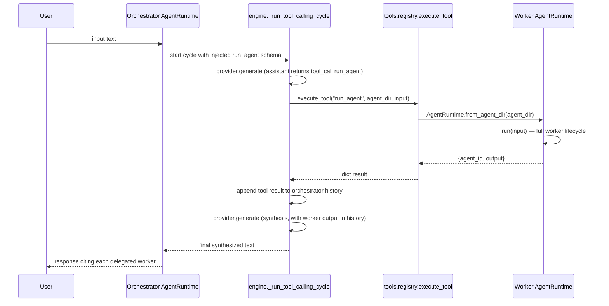

# Multi-Agent Orchestration

## Overview

AgentForge supports a delegation pattern in which an **orchestrator** agent decomposes a complex request into subtasks, hands each one to a specialized **worker** agent, and then synthesizes the worker outputs into a final answer. Delegation is not a special execution mode: it is implemented as an ordinary tool, `run_agent`, that the engine injects into the orchestrator's tool schema whenever the orchestrator's spec declares workers under `workflow.agents`.

The pattern is anchored by the repo's `agents/orchestrator` agent, which declares `lab-ops` (and can declare any number of workers) in its `agent.yaml` and is guided by guardrails to delegate before answering about specialized domains.

## How delegation is wired

### Declaring workers

The `WorkflowSpec` model (`src/agentforge/core/agent_models.py`) carries the worker list:

```python
class AgentRef(BaseModel):
    name: str
    agent_dir: str
    description: str | None = None

class WorkflowSpec(BaseModel):
    mode: str
    multi_turn: bool = False
    max_tool_cycles: int = 3
    reflection_rounds: int = 0
    agents: list[AgentRef] = []   # workers available for delegation
```

Each entry is an `AgentRef` — a name, a directory (relative to the working root, e.g. `agents/lab-ops`), and an optional human description. The orchestrator's `agents/orchestrator/agent.yaml` uses it like this:

```yaml
workflow:
  mode: respond_or_tool
  max_tool_cycles: 8
  reflection_rounds: 1
  agents:
    - name: lab-ops
      agent_dir: agents/lab-ops
      description: Server health monitoring, CPU/RAM/GPU metrics, and log inspection
```

### Auto-injecting `run_agent` into the tool schema

`AgentRuntime._build_tools_schema()` (`src/agentforge/runtime/engine.py`) converts every `ToolSpec` in the agent's `tools.yaml` into a function schema entry, and then — **only when `self.agent_spec.workflow.agents` is non-empty** — appends one more entry named `run_agent`:

- The description lists every declared worker as `- <name> (agent_dir=<agent_dir>): <description>`.
- The parameters are `agent_dir: string` (required) and `input: string` (required), with `required: ["agent_dir", "input"]`.

```python
# Injeta run_agent quando há workers declarados no workflow.
declared_agents = self.agent_spec.workflow.agents
if declared_agents:
    agents_list = "\n".join(
        f"  - {a.name} (agent_dir={a.agent_dir}): {a.description or 'no description'}"
        for a in declared_agents
    )
    schema.append({
        "type": "function",
        "function": {
            "name": "run_agent",
            "description": (
                "Delegates a task to a specialized agent and returns the output.\n"
                f"Available agents:\n{agents_list}"
            ),
            "parameters": {
                "type": "object",
                "properties": {
                    "agent_dir": {"type": "string", "description": "Agent directory (use the agent_dir values listed above)"},
                    "input": {"type": "string", "description": "Task or question for the agent"},
                },
                "required": ["agent_dir", "input"],
            },
        },
    })
```

**Key invariant: a worker is delegable by a given agent only if it appears in that agent's `workflow.agents`.** The model cannot invent agents — it can only pick `agent_dir` values that the schema description lists, and the description is built exclusively from `workflow.agents`. If `workflow.agents` is empty, `run_agent` is absent from the schema entirely, so the model cannot even see the tool.

This invariant is covered by the `TestMultiAgent` suite in `tests/test_runtime_engine.py`:
- `test_run_agent_injected_in_schema_when_workers_declared` — `run_agent` is present when `agents=[...]`.
- `test_run_agent_not_in_schema_when_no_workers` — `run_agent` is absent when `agents=[]`.
- `test_run_agent_schema_lists_worker_names_and_dirs` — each declared worker's name and `agent_dir` appear in the description.
- `test_run_agent_schema_has_correct_parameters` — `agent_dir` and `input` are required parameters.

### Executing a delegation: the `run_agent` tool

The tool is registered as a builtin in `src/agentforge/tools/registry.py`:

```python
register_tool("run_agent", run_agent)
```

and is defined in `src/agentforge/tools/run_agent.py`:

```python
def run_agent(agent_dir: str, input: str) -> dict:
    """Loads an AgentRuntime and executes a task. Returns output and agent_id."""
    from agentforge.runtime.engine import AgentRuntime  # lazy — avoids circular import

    runtime = AgentRuntime.from_agent_dir(agent_dir)
    result = runtime.run(input)
    return {
        "agent_id": result["agent_id"],
        "output": result["output"],
    }
```

Three properties of this function matter:

1. **Workers are loaded fresh per call.** `AgentRuntime.from_agent_dir(agent_dir)` re-reads the worker's `agent.yaml` (validated into an `AgentSpec`), `runtime.yaml` (flattened into a `RuntimeConfig`), and optional `tools.yaml` each time `run_agent` is invoked. There is no caching: every delegation re-loads the worker's spec from disk, so a spec edit takes effect on the next call without restarting the orchestrator.
2. **The worker's full runtime lifecycle runs.** `runtime.run(input)` drives the worker through the same pipeline the orchestrator uses — input preparation, tool-calling cycle, guardrail checks, reflection, memory persistence, and `runs.jsonl` logging — all scoped to the worker's own `runtime_config` and `root_dir`. The worker's `max_tool_cycles`, `memory`, and `required: true` tools are honoured independently of the orchestrator's.
3. **Only a flat result is returned.** The orchestrator never sees the worker's internal history, tool log, or provider metadata — only `{agent_id, output}`. `agent_id` comes from the worker's `runtime_config` (which is why the tool can identify which declared worker answered), and `output` is the worker's final text after its own guardrail and reflection passes.

Because `run_agent` is a builtin tool, the orchestrator's tool-calling cycle executes it through the same `execute_tool` path as any other tool, and the returned dict is JSON-serialised into a `tool`-role message appended to the orchestrator's conversation.

### Result injection and synthesis

Back in `_run_tool_calling_cycle` (`engine.py`), after `self._execute_tool(tool_name, **tool_args)` returns, the result is stringified and appended as `{"role": "tool", "content": result_text, "name": tool_name}`. The next provider call receives that message as part of `history`, so the orchestrator's model reads the worker's output as a normal tool result and can:

- issue further `run_agent` calls (e.g. fan out to a second worker),
- issue calls to its own non-delegation tools, or
- produce the final synthesized answer, which the orchestrator's own guardrails then enforce (e.g. "cite which agent performed each delegated task", "do not invent results from agents that were not called").

The orchestrator's `agents/orchestrator/agent.yaml` makes synthesis an explicit `guardrails.must`:

```yaml
guardrails:
  must:
    - cite which agent performed each delegated task
    - synthesize results from multiple agents into a cohesive response
    - use run_agent to delegate before responding about specialized domains
  must_not:
    - invent results from agents that were not called
    - respond about server health without delegating to lab-ops
```

Because the engine injects `guardrails.must` into the user input on every run (`_inject_rules_to_input`) and then verifies it deterministically and via the LLM judge (`_check_must_compliance`), the "cite the agent" and "synthesize" obligations are enforced, not just suggested.

## Sequence



*Caption: A single delegation round — orchestrator model emits a `run_agent` tool call, the engine spawns the worker runtime, the worker result is appended to orchestrator history as a `tool` message, and the orchestrator model synthesizes a final answer.*

## Invariants and failure modes

- **Schema is the gate.** Workers not listed in the orchestrator's `workflow.agents` never appear in `run_agent`'s description, so the model cannot delegate to them by name. A typo'd `agent_dir` from the model will fail inside `from_agent_dir` (missing/invalid spec) and surface as a tool error in the next tool message, giving the model a chance to retry with a listed value.
- **Workers are stateless between delegations from the orchestrator's perspective.** Each `run_agent` call constructs a new `AgentRuntime`. If the worker's `workflow.multi_turn` and memory policy load persisted history from its own `root_dir`, that is a per-worker concern; the orchestrator's conversation history is untouched by worker runs.
- **Worker failures surface as tool errors, not orchestrator crashes.** `_execute_tool` wraps execution and converts `TypeError`s into `{"error": ...}`; other exceptions propagate to the tool message. The orchestrator's model then sees the error text in a `tool`-role message and can respond accordingly (e.g. delegate to a different worker or answer from what it has).
- **No parallel fan-out in the schema.** Multiple delegations happen sequentially within the orchestrator's tool-calling cycle, bounded by the orchestrator's `max_tool_cycles` (e.g. 8 for `agents/orchestrator`). Each delegation consumes one cycle round alongside any other tool calls the model emits in the same assistant turn.
- **The worker is validated, not trusted.** `AgentRuntime.from_agent_dir` calls `validate_agent_spec(root_dir / "agent.yaml")`, so a malformed worker spec fails fast at delegation time rather than mid-run.

## Extension points

- **Add a worker:** create its agent directory (spec + `runtime.yaml` + `tools.yaml` + `system_prompt.md`) and add an `AgentRef` to the orchestrator's `workflow.agents`. Nothing else in the codebase needs to change — the schema builder and the tool are generic.
- **Add a second orchestrator:** any agent whose `workflow.agents` is non-empty becomes an orchestrator. The pattern is composable, so a worker could itself declare workers, subject to the same per-agent declaration gate.
- **Add worker-specific policy:** tune each worker's `max_tool_cycles`, `reflection_rounds`, memory, and guardrails independently in its own `agent.yaml`/`runtime.yaml`; the orchestrator inherits none of this automatically.

## Tests

`tests/test_runtime_engine.py::TestMultiAgent` covers the schema-injection contract and the tool-execution contract:

- `test_run_agent_injected_in_schema_when_workers_declared`
- `test_run_agent_not_in_schema_when_no_workers`
- `test_run_agent_schema_lists_worker_names_and_dirs`
- `test_run_agent_schema_has_correct_parameters`
- `test_run_agent_tool_executes_worker_and_returns_output` — mocks `AgentRuntime.from_agent_dir`, calls the real `run_agent(agent_dir=..., input=...)`, and asserts the returned `{agent_id, output}` matches the mocked worker run.

## Related pages

- [`/openwiki/domain/agents.md`](/openwiki/domain/agents.md) — agent spec model and directory layout.
- [`/openwiki/tools/tool-system.md`](/openwiki/tools/tool-system.md) — tool registry, `execute_tool`, and how builtin tools are registered.
- [`/openwiki/workflows/execution-pipeline.md`](/openwiki/workflows/execution-pipeline.md) — the per-run pipeline the worker goes through when `run_agent` calls `runtime.run(input)`.
