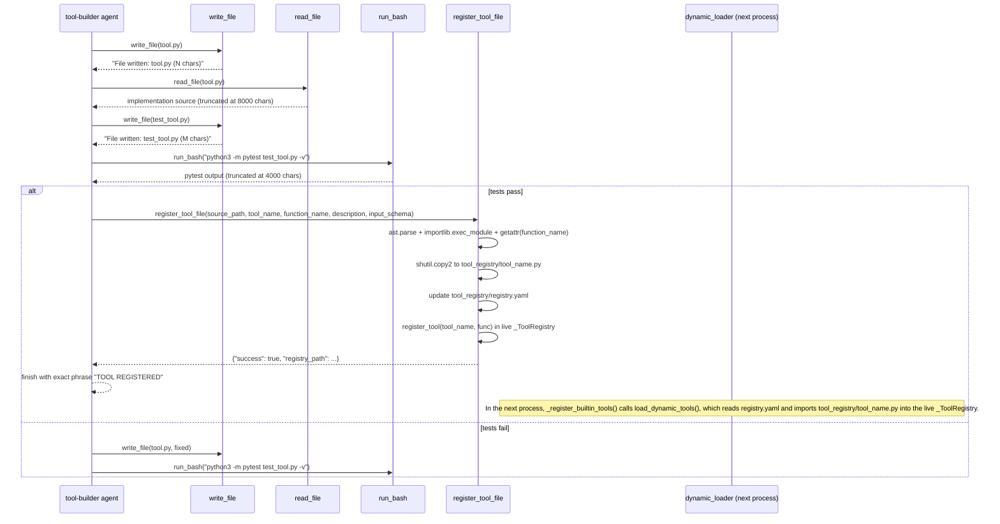

# Tool Self-Registration (Voyager Pattern)

## Overview

Tool self-registration is AgentForge's mechanism for **extending itself at runtime**. A specialized agent (`tool-builder`) receives a natural-language description of a desired capability, writes the implementation and its pytest suite in its working directory, proves the tests pass, and then commits the tool to the framework via the builtin `register_tool_file` tool. Once registered, the tool lives on disk under `tool_registry/`, is recorded in the persistent `tool_registry/registry.yaml`, and is imported automatically by `dynamic_loader` the next time any agent process starts — behaving exactly like a builtin.

This is the **Voyager pattern** (NVIDIA, 2023): open-ended accumulation of skills generated by the system itself. The full registry architecture (global `_ToolRegistry`, builtin catalogue, manifest schema) is documented on the [Tool System](../tools/tool-system.md) page; this page traces one end-to-end run of the creation flow.

## Participants

| Participant | Location | Role in the flow |
|---|---|---|
| **tool-builder agent** | `agents/tool-builder/agent.yaml` | Orchestrates the flow: decides when to write, re-read, test, and register. `max_tool_cycles: 20` — the largest in the catalogue, sized for the multi-step write → re-read → test → register loop. |
| **`write_file`** | `src/agentforge/tools/write_file.py` | Writes the implementation `<tool>.py` and the test file `test_<tool>.py` into `AGENT_WORKDIR` (relative paths resolved against the env var; parents created on demand). |
| **`read_file`** | `src/agentforge/tools/write_file.py` | Re-reads the implementation before tests are written. Truncates to 8000 chars. |
| **`run_bash`** | `src/agentforge/tools/run_bash.py` | Runs `pytest` in `AGENT_WORKDIR` under a destructive-command blocklist and a `BASH_TIMEOUT` (default 1800 s). Output is captured to a temp file and truncated to 4000 chars. |
| **`register_tool_file`** | `src/agentforge/tools/register_tool_file.py` | Validates the source file, copies it to `tool_registry/`, updates `registry.yaml`, and registers the function in the live `_ToolRegistry`. The only writer of the manifest. |
| **`dynamic_loader.load_dynamic_tools`** | `src/agentforge/tools/dynamic_loader.py` | At process startup, reads `registry.yaml` and imports every registered file into the live registry. Called once by `_register_builtin_tools()` in `registry.py`, after all builtins are registered. |

The `tool-builder` spec pins the workflow with `must` / `must_not` guardrails that the engine enforces deterministically:

```yaml
guardrails:
  must:
  - use read_file to re-read the implementation before writing tests
  - execute pytest before registering the tool
  - register the tool with register_tool_file only after tests pass
  - finish with the exact phrase 'TOOL REGISTERED'
  must_not:
  - register tool with failing tests
  - invent that tests passed without executing run_bash with pytest
```

The engine's `must`-compliance check (`AgentRuntime._missing_must_files`) additionally verifies that any filename-shaped quoted term in a `must` rule actually exists in `AGENT_WORKDIR` before the run is considered compliant — so a spec that promised a file which was never written is flagged at the guardrail stage, not just by the LLM judge.

## End-to-end flow

The canonical sequence, matching the `docs/TOOL-REGISTRY.md` creation flow, is:

1. **`write_file("<tool>.py")`** — the agent writes the implementation into `AGENT_WORKDIR`.
2. **`read_file("<tool>.py")`** — the agent re-reads what it just wrote. This is a coherence step: it forces the model to look at the actual content before authoring tests against it, which is what keeps the test's import path, function name, and call signature consistent with the implementation. The `read_file` tool truncates at 8000 chars, so very large files must be kept small enough to round-trip.
3. **`write_file("test_<tool>.py")`** — the agent writes a pytest suite in the same directory.
4. **`run_bash("python3 -m pytest test_<tool>.py -v")`** — a real test run. The agent must observe the actual stdout; `must_not` forbids claiming pytest passed without executing it.
5. **On failure:** the agent fixes the implementation or the test and loops back to step 4. The `run_bash` output (with the 4000-char truncation) is the only evidence the model has about the run.
6. **On success:** **`register_tool_file(source_path=..., tool_name=..., function_name=..., description=..., input_schema=...)`** validates the file, copies it to `tool_registry/<tool_name>.py`, appends (or replaces the same-named entry of) `registry.yaml`, and registers the function in the current-process `_ToolRegistry` so it is callable without a restart.
7. **Next session:** `load_dynamic_tools()` reads `registry.yaml`, imports the new file, and the tool becomes available to any agent that declares it in its `agent.yaml` — exactly like a builtin.

## Sequence diagram


*Caption: tool-builder writing, testing, and registering a tool; the dashed participant (dynamic_loader) only fires in subsequent process starts, not within the same session.*

## What `register_tool_file` validates

`register_tool_file(source_path, tool_name, function_name, description, input_schema="{}", created_by="tool-builder")` performs four checks, in order, before touching the registry. Any failure short-circuits with `{"success": false, "error": "<reason>"}` and leaves `tool_registry/` untouched:

1. **File exists.** `source_path` is resolved against `AGENT_WORKDIR` (absolute paths pass through unchanged). A missing file returns `File not found: <path>`.
2. **Valid Python syntax.** `ast.parse(source.read_text())` must succeed; a `SyntaxError` is reported verbatim.
3. **Module imports cleanly.** The file is loaded as a fresh module under the synthetic key `_agentforge_validate_<tool_name>` via `importlib.util.spec_from_file_location` + `module_from_spec` + `exec_module`. Any exception during execution is returned as `Import error: <e>`. This is a real import, so a file that parses but raises at import time (bad top-level code, missing dependency) is rejected here.
4. **Named function exists.** `getattr(module, function_name, None)` must return a callable; a missing or misspelled `function_name` returns `Function '<name>' not found in the module`.

On success it then:

- Copies the source file to `tool_registry/<tool_name>.py` with `shutil.copy2` (preserving metadata).
- Rewrites `tool_registry/registry.yaml`, **removing any existing entry with the same `tool_name`** before appending a new one with fields `name`, `file` (always `<tool_name>.py`), `function`, `description`, `input_schema` (JSON string), `created_by`, and `registered_at` (ISO-8601 UTC). There is **no versioning**: re-registering with the same name silently overwrites the previous version.
- Registers the already-loaded function object in the live `_ToolRegistry` via `register_tool(tool_name, func)` so the tool is callable in the *current* process immediately, without waiting for the next session.

### Filename convention

The copy step always names the destination `tool_registry/<tool_name>.py`, and the manifest entry stores `file: <tool_name>.py`. This couples the manifest back to the source file for `dynamic_loader` — which re-imports the file from `tool_registry/` (not from `AGENT_WORKDIR`) the next time a process starts. The `function_name` parameter, in contrast, is free: it names the public function inside the module to expose as the tool, and it need not match `tool_name` (in practice they usually do).

### Failure semantics

Because every validation step returns a plain error dict rather than raising, the tool-builder agent sees the failure as an ordinary tool result and can loop back to fix the file. The two failure classes the flow is most sensitive to:

- **Test failure in `run_bash`** — the agent must not call `register_tool_file` until pytest passes. The `must_not` guardrail makes a violation a scored regression, not just a model mistake.
- **`register_tool_file` import error** — typically a missing dependency or a top-level raise in the new tool. The registry is untouched, so the agent can edit the file in `AGENT_WORKDIR` and retry; nothing is corrupted.

## Lifecycle of a registered tool

A tool's lifecycle crosses a process boundary:

- **Inside the creating session** the tool is registered in the live `_ToolRegistry` by `register_tool_file` itself, so the same agent process can immediately call it via `execute_tool(tool_name, ...)`.
- **Between sessions** the tool exists purely on disk: `tool_registry/<tool_name>.py` plus a row in `registry.yaml`. No code path holds it in memory.
- **In the next (or any) session** `_register_builtin_tools()` (which runs at `agentforge.tools.registry` import time) calls `load_dynamic_tools()` *after* all builtins have been registered. `load_dynamic_tools` walks `registry.yaml`, imports each file under the synthetic module key `_agentforge_dynamic_<name>`, and binds its `function` to the entry's `name`.

The order in `registry.py` matters:

```python
_register_builtin_tools()   # at module import time
#   ... registers every builtin (including register_tool_file) ...
#   then:
load_dynamic_tools()        # agent-generated tools land in the same _ToolRegistry
```

Because dynamic tools are appended after the builtin pass, they cannot shadow a builtin at startup, and `register_tool_file` itself is always available even to the first agent in a fresh process.

## Silent failures in `load_dynamic_tools`

`load_dynamic_tools` is deliberately forgiving. Every per-entry failure is swallowed so that one broken tool cannot take down the process:

- `registry.yaml` missing or unparseable YAML → returns `[]` (no tools loaded, no exception).
- File listed in `registry.yaml` not found on disk → `continue` (skipped).
- `spec_from_file_location` returns `None` or `exec_module` raises → `continue`.
- `function_name` not present in the module → `continue`.

A corrupted `tool_registry/*.py` therefore produces **no log line and no error at startup**, only the absence of the tool. There is no per-entry error reporting to the operator, and the tool is simply not in `_ToolRegistry`. This is a known limitation noted in `docs/TOOL-REGISTRY.md`; the proposed fix (a startup syntax check inside the loader) is listed as a "next step".

## Using a registered tool in another agent

After registration, any agent can use the tool by declaring it under `tools:` in its `agent.yaml`:

```yaml
tools:
  - name: search_memory
    description: Busca na agent-mesh shared_memory por query LIKE no key e value.
    when_to_use: "Usar quando precisar recuperar contexto de sessões anteriores."
    input_schema: '{"type":"object","properties":{"query":{"type":"string"}},"required":["query"]}'
```

The engine generates the OpenAI/Ollama function schema from the `ToolSpec`, and the model decides when to call it. The registry entry's `description` and `input_schema` (stored in `registry.yaml`) are what `register_tool_file` used when registering, but each consuming agent re-declares them in its own spec so the model's context matches the agent's own vocabulary.

## Failure modes and invariants

- **Guardrail enforcement is the primary safety net.** `register_tool_file` itself has no notion of "tests passed" — it trusts the caller. The `must`/`must_not` rules in the tool-builder spec, the deterministic `_missing_must_files` check, and the final-phrase requirement (`TOOL REGISTERED`) are what prevent a broken tool from being committed.
- **Re-registration overwrites.** There is no versioning in `registry.yaml`. Re-running `register_tool_file` for the same `tool_name` replaces the file and the manifest entry, with a fresh `registered_at` timestamp. Rollback requires git, not the framework.
- **Silent startup failures.** A bad dynamic tool is invisible at startup; it only manifests as a `None` from `get_tool` when an agent tries to call it. See the silent-failure section above.
- **`AGENT_WORKDIR` is the scope for every file the flow touches.** The implementation, the test file, the source path passed to `register_tool_file` (when relative), and `run_bash`'s cwd all resolve against the same env var. Deployments must set it consistently for the flow to work at all.
- **The live-process registration is not idempotent with respect to the source file.** `register_tool_file` registers the function object it loaded from the source file at that moment. If the file is later edited in `tool_registry/` without re-registering, the running process still holds the older function; only the next `load_dynamic_tools` (i.e., the next process) picks up the change.

## Example: `search_memory`

The canonical shipped example is `search_memory`, created by `tool-builder+human-fix` on 2026-06-06. The manifest entry in `tool_registry/registry.yaml` and the implementation in `tool_registry/search_memory.py` follow the same shape every self-registered tool has: a public function named after the tool, a JSON-string `input_schema` in the manifest, and a `created_by` that names the authoring agent. The file itself implements a mem0 semantic-search primary with a SQLite `LIKE` fallback on the agent-mesh `shared_memory` table.

Later-registered tools (the `browser_*`, `buscar_precos_br`, and `comfyui_*` entries currently in `registry.yaml`) were authored by `claude-code` rather than by the in-framework tool-builder, but they exercise the same registration path and loader — the registry does not distinguish between the two origins beyond the `created_by` string.

## Related

- [Tool System](../tools/tool-system.md) — full registry architecture, builtin catalogue, manifest schema, and `run_bash` / `write_file` / `read_file` internals.
- [Agent Domains](../domain/agents.md) — the `tool-builder` spec in the context of the full agent catalogue.
- [Execution Pipeline](./execution-pipeline.md) — how the tool-calling loop, guardrail checks, and `_missing_must_files` run on each cycle of the tool-builder session.
